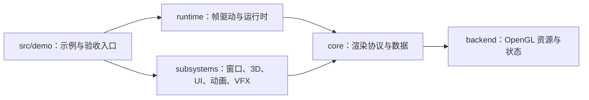

# 新人快速上手：从第一个窗口到渲染管线

这份指南面向第一次接触 Haikalat 的开发者。目标不是一次读完所有 OpenGL 细节，而是用一条可验证的路径回答三个问题：项目怎么跑、代码从哪里开始看、我应该把新代码放在哪里。

建议按下面的顺序阅读：先运行 `EmptyWindowDemo`，再阅读 `MinimalDemo`，最后阅读主 Demo 和对应的 subsystem。大多数代码用例都直接取自仓库中的正式 Demo，示例中的省略部分只代表上下文代码，不代表另有一套 API。

## 1. 先建立整体认识

Haikalat 是一个基于 Java 21、LWJGL 和 OpenGL 4.6 Core Profile 的实时渲染项目。代码按以下方向组织：



可以先记住这条依赖规则：`subsystems/runtime -> core -> backend`。底层不应反向依赖上层；生产代码中的 OpenGL 原始调用也应集中在 backend 或已有的受控适配层中。

## 2. 第一次运行

### 环境

- JDK 21 或更高版本。Gradle 会使用 Java 21 toolchain。
- 支持 OpenGL 4.6 Core Profile 的 GPU 和驱动。
- Windows 或 Linux 桌面会话。Demo 会创建 GLFW 窗口，不能在无桌面的纯 headless 会话中直接运行。

Windows 使用 `gradlew.bat`；Linux 将下面命令中的 `.\gradlew.bat` 换成 `./gradlew`。

### 推荐的第一次命令

先编译主代码、Demo 和单元测试：

```powershell
.\gradlew.bat compileJava demoClasses test
```

然后按由简到繁的顺序运行：

```powershell
# 只有窗口、clear 和 present，不创建 shader 或 mesh
.\gradlew.bat runEmptyWindowDemo

# 最小同步渲染：shader、mesh、texture、material、实例化和 resize
.\gradlew.bat runMinimalDemo

# 完整基准场景：光照、阴影、HDR/AA/Bloom、诊断面板
.\gradlew.bat runLearnOpenGlDemo
```

第一次只想验证渲染路径，不想一直开着窗口时，可以运行固定帧数的隐藏集成入口：

```powershell
.\gradlew.bat runMinimalIntegration
.\gradlew.bat runDemoIntegration
```

这两个入口会编译 Demo 并在支持 OpenGL 的桌面环境中运行有限帧数；它们不是纯 JVM 测试。

### IDE 运行

用 IntelliJ IDEA 或其他支持 Gradle 的 IDE 导入项目根目录，使用 JDK 21。Demo 不在默认的 `src/main/java`，而是在 Gradle 的 `demo` source set 中：

- 入口源码：`src/demo/java`
- Demo 资源：`src/demo/resources`
- 主代码：`src/main/java`
- 单元测试：`src/test/java`

如果 IDE 没有正确识别 `demo` source set，优先使用上面的 Gradle `run...Demo` 任务；也可以直接运行这些类的 `main` 方法：

| 目的 | main class |
| --- | --- |
| 空窗口基线 | `com.kaleblangley.haikalat.demo.EmptyWindowDemo` |
| 最小渲染 | `com.kaleblangley.haikalat.demo.MinimalDemo` |
| 完整场景 | `com.kaleblangley.haikalat.demo.LearnOpenGlDemo` |
| CPU 动画 | `com.kaleblangley.haikalat.demo.animation.AnimationDemo` |
| glTF/PBR | `com.kaleblangley.haikalat.demo.gltf.GltfDemo` |
| UI | `com.kaleblangley.haikalat.demo.ui.UiDemo` 或 `ModernUiDemo` |
| 异步上传 | `com.kaleblangley.haikalat.demo.async.AsyncDemo` |

## 3. 项目目录地图

| 目录 | 新人需要知道的内容 |
| --- | --- |
| `src/main/java/.../backend` | OpenGL 资源和底层状态：shader、buffer、texture、framebuffer、VAO/vertex layout、GPU timer、状态缓存。 |
| `src/main/java/.../core` | 与具体场景无关的协议：`CommandBuffer`、`RenderDevice`、`RenderGraph`、mesh、material、资源定位、presentation。 |
| `src/main/java/.../runtime` | `FrameDriver`、`RenderSettings`、帧统计、诊断和运行时编排。 |
| `src/main/java/.../subsystems/windowing` | GLFW 窗口、输入、resize 和文本输入适配。 |
| `src/main/java/.../subsystems/render3d` | Camera、Scene、RenderPipeline、普通/实例化 renderer、阴影、PBR 和后处理接入。 |
| `src/main/java/.../subsystems/animation` | 不依赖 OpenGL 的 clip、player、graph、layer、constraint 和 pose 求值。 |
| `src/main/java/.../subsystems/ui` | retained UI 文档树、布局、文本、输入、动画、compositor 和 UI renderer。 |
| `src/main/java/.../subsystems/vfx` | 不依赖 OpenGL 的粒子、Ribbon、Decal 和效果快照；`render3d/vfx` 负责渲染适配。 |
| `src/main/java/.../subsystems/resources`、`subsystems/scene` | `AssetId`、资源目录、异步 CPU 解码、场景 JSON、代次和热重载。 |
| `src/demo/java` | 可运行的示例、集成验证和性能基准。新功能的第一份证明通常放在这里。 |
| `src/main/resources`、`src/demo/resources` | 主库资源与 Demo 资源；shader 路径通常以 `/` 开头，从 classpath 根解析。 |
| `src/test/java` | JVM 单元测试、架构边界测试和需要 OpenGL 的 smoke/integration 测试。 |
| `gradle/*.gradle` | Demo、UI、场景、诊断和发布任务的定义。新增 Demo 任务前先查这里是否已有通用注册器。 |
| `docs/architecture`、`docs/guides` | 设计约束、线程/资源所有权、测试策略和功能指南。 |

### 生成代码在哪里

`generateProceduralShaders` 会从内置 mesh 数据生成压力测试 shader 和 Java catalog，输出只在 `build/generated` 下。`compileDemoJava` 和 `processDemoResources` 会自动依赖这个生成任务；不要手动把生成文件提交到 `src`。

## 4. 一帧是怎样走完的

常规同步 Demo 的生命周期可以概括为：

1. `GlfwWindow.Builder` 创建窗口并固定请求 OpenGL 4.6 Core Profile。
2. `bindContext()` 绑定当前线程的 GL context，随后调用 `GL.createCapabilities()`。
3. 在 context 所在线程创建 `ShaderProgram`、`Mesh`、`Texture2D`、`RenderGraph` 和 renderer。
4. 每帧读取窗口输入；如果 `consumeResize()` 为真，调用 `graph.resize(...)` 或 `pipeline.resize(...)`。
5. 更新 CPU 状态：相机、场景对象、动画、UI 和 VFX。
6. `FrameDriver.frame(graph)` 调用 `RenderGraph.execute(...)`，执行每个 pass 的 typed `CommandBuffer`。
7. `FrameDriver.present(window::swapBuffers)` 执行交换缓冲区，最后 `pollEvents()`。
8. 用 `try-with-resources` 按所有权关闭 GPU 和 native 资源。

`FrameDriver` 负责帧边界、上传队列、统计和诊断；`RenderGraph` 负责 pass 拓扑、managed framebuffer/texture 以及 pass 的执行顺序；`RenderPipeline` 在此之上组织完整 3D 场景。

## 5. 代码用例一：最小窗口和 RenderGraph

下面是从 [`EmptyWindowDemo.java`](../../src/demo/java/com/kaleblangley/haikalat/demo/EmptyWindowDemo.java) 抽出的最小骨架。它展示了窗口、GL context、一个 backbuffer pass、resize、帧提交和 present 的完整关系。

```java
package com.kaleblangley.haikalat.demo;

import com.kaleblangley.haikalat.backend.GlDebug;
import com.kaleblangley.haikalat.core.graph.RenderGraph;
import com.kaleblangley.haikalat.runtime.FrameDriver;
import com.kaleblangley.haikalat.runtime.RenderSettings;
import com.kaleblangley.haikalat.subsystems.windowing.GlfwWindow;
import org.lwjgl.opengl.GL;

import static org.lwjgl.glfw.GLFW.GLFW_KEY_ESCAPE;

public final class NewcomerClearDemo {
    public static void main(String[] args) {
        RenderSettings settings = RenderSettings.builder()
                .vsync(false)
                .build();

        try (GlfwWindow window = new GlfwWindow.Builder()
                .dimensions(1280, 720)
                .title("Newcomer Demo")
                .visible(true)
                .build()) {
            window.bindContext();
            GL.createCapabilities();
            GlDebug.enableDebugCallback();

            try (FrameDriver driver = new FrameDriver(settings);
                 RenderGraph graph = new RenderGraph(window.width(), window.height())) {
                graph.addPass("Clear")
                        .writeToBackbuffer()
                        .noClear()
                        .execute((resources, commands) -> commands
                                .clearColor(0.025f, 0.03f, 0.045f, 1.0f)
                                .clear(true, true));
                graph.compile();

                while (!window.shouldClose()) {
                    if (window.consumeResize()) {
                        graph.resize(window.width(), window.height());
                    }
                    if (window.isKeyDown(GLFW_KEY_ESCAPE)) {
                        window.requestClose();
                    }

                    driver.frame(graph);
                    driver.present(window::swapBuffers);
                    window.pollEvents();
                }
            }
        }
    }
}
```

几个容易忽略的点：

- `GlfwWindow` 默认隐藏窗口；需要交互运行时要 `.visible(true)`，或初始化完成后调用 `show()`。
- `FrameDriver` 必须在 GL context 建立后创建。
- 窗口尺寸实际使用 framebuffer 像素尺寸；resize 后要重建 managed target。
- `RenderGraph` 的拓扑应在 `compile()` 前完成；UI 的 `attachTo(...)` 也属于拓扑接入，应放在 compile 前。

## 6. 代码用例二：shader、mesh、texture、material 和命令

[`MinimalDemo.java`](../../src/demo/java/com/kaleblangley/haikalat/demo/MinimalDemo.java) 是最适合学习一次普通 draw 的地方。资源准备和单次绘制的核心形态如下：

```java
ShaderProgram shader = ShaderProgram.fromResource(
        MinimalDemo.class,
        "/shaders/basic/color-mvp.vert",
        "/shaders/basic/vertex-color-unlit.frag");

Mesh triangle = Mesh.from(
        BuiltinMeshData.coloredTriangle("newcomer-triangle"));

Material material = Material.builder(shader)
        .blendMode(BlendMode.OPAQUE)
        .build();

// commands 来自当前 RenderGraph pass，mvp 是本帧计算出的投影/视图/模型矩阵。
material.bind(commands);
commands.setUniformMat4(shader, "uMvp", mvp)
        .bindMesh(triangle)
        .drawMesh(triangle);
```

纹理材质只需要把纹理声明到 material 中：

```java
ShaderProgram texturedShader = ShaderProgram.fromResource(
        MinimalDemo.class,
        "/shaders/basic/textured-mvp.vert",
        "/shaders/basic/textured-unlit.frag");
Texture2D wall = Texture2D.fromResource(
        MinimalDemo.class,
        "/textures/learnopengl/wall.png",
        false,
        TextureColorSpace.SRGB);

Material textured = Material.builder(texturedShader)
        .texture("uTexture", wall)
        .setVec3("uTint", new Vector3f(1.0f))
        .blendMode(BlendMode.OPAQUE)
        .build();
```

这里的职责边界是：`ShaderProgram`、`Mesh` 和 `Texture2D` 持有 GL 资源；`Material` 描述如何绑定 shader、纹理和 uniform；`CommandBuffer` 只记录本帧要执行的操作。绘制完成后应关闭真正持有 native/GL 资源的对象，例如：

```java
try {
    // 创建资源、记录命令并提交帧
} finally {
    triangle.close();
    wall.close();
    texturedShader.close();
    shader.close();
}
```

完整的 framebuffer、实例化和 blit 流程也在 `MinimalDemo` 中，先不要从 `LearnOpenGlDemo` 的数百行资源配置开始读。

## 7. 代码用例三：用 RenderGraph 组织多 pass

`RenderGraph` 中的 pass 通过逻辑名称和依赖连接，而不是在业务代码里手工维护一串 framebuffer。下面的片段展示一个离屏 HDR 场景 pass 加一个 backbuffer 后处理 pass；后处理 shader 和 fullscreen mesh 省略。

```java
RenderGraph graph = new RenderGraph(width, height);

graph.addPass("Scene")
        .createColor("sceneColor", RenderFormat.RGBA16F)
        .createDepth()
        .execute((resources, commands) -> {
            // 当前 pass 的 managed framebuffer 已经被 RenderGraph 绑定。
            commands.clearColor(0.08f, 0.10f, 0.14f, 1.0f)
                    .clear(true, true);
            drawScene(commands);
        });

graph.addPass("Present")
        .dependsOn("Scene")
        .writeToBackbuffer()
        .noClear()
        .execute((resources, commands) -> {
            int sceneColor = resources.colorAttachment("sceneColor");
            commands.bindTexture(0, sceneColor);
            drawFullscreenPostProcess(commands);
        });

graph.compile();
```

约定如下：

- `createColor("sceneColor", ...)` 声明一个由 graph 管理的逻辑颜色附件；resize 时 graph 会重建它。
- `dependsOn("Scene")` 明确执行顺序；`Present` 会在 `Scene` 后执行。
- `PassResources.colorAttachment(...)` 返回逻辑附件对应的 texture id，不需要业务代码接触 framebuffer 的 native id。
- topology 改完后再 `compile()`；运行中尺寸变化使用 `resize()`，不要重复添加同名 pass。

主场景的真实版本见 [`LearnOpenGlDemo.java`](../../src/demo/java/com/kaleblangley/haikalat/demo/LearnOpenGlDemo.java) 和 [`RenderPipeline.java`](../../src/main/java/com/kaleblangley/haikalat/subsystems/render3d/RenderPipeline.java)。

## 8. 功能用例：UI 和 CPU 动画

### UI

UI 是 retained tree：逻辑线程更新 `UiDocument`，渲染 pass 消费发布的 snapshot。[`ModernUiDemo.java`](../../src/demo/java/com/kaleblangley/haikalat/demo/ui/ModernUiDemo.java) 的最小接入形态是：

```java
try (UiSystem ui = UiSystem.create(window, UiConfig.defaults())) {
    ui.document().root().add(new Label("Hello Haikalat"));
    ui.attachTo(graph, "Present");
    graph.compile();

    while (!window.shouldClose()) {
        window.pollEvents();
        ui.update(window.inputSnapshot(), deltaSeconds);
        driver.frame(graph);
        driver.present(window::swapBuffers);
    }
}
```

`UiSystem.update(...)` 必须在 UI 所属的 update 线程调用；`attachTo(...)` 要引用已经存在的最终 pass。复杂的 UI 动画、文本和 IME 先分别看 [`docs/guides/ui-animation-compositor-vfx.md`](ui-animation-compositor-vfx.md) 与 [`docs/guides/windows-ime.md`](windows-ime.md)。

### CPU 动画

动画 runtime 不依赖 OpenGL，适合先用纯 JVM 测试理解。核心循环是创建 pose buffer、播放 clip、每帧写入 pose：

```java
PoseBuffer pose = skeleton.createPoseBuffer();
AnimationPlayer player = new AnimationPlayer(skeleton)
        .play(clip, AnimationPlayer.LoopMode.LOOP);

player.update(deltaSeconds, pose);
```

`AnimationDemo` 还展示了 graph、additive layer、Bone Mask 和 constraint；不要把 animation subsystem 直接改成调用 `org.lwjgl.opengl.*`。如果功能需要 GPU skinning，应该由 `render3d/gltf` 或对应 renderer 消费 pose 结果。

## 9. 新功能应该放在哪里

可以按下面的决策顺序开始工作：

1. **纯数据、算法或可复用协议**：放 `src/main/java/.../core` 或对应的无 GL subsystem，并先写 JVM 单元测试。
2. **OpenGL 资源、状态或命令执行**：优先复用 `backend`、`CommandBuffer`、`RenderDevice` 和 `RenderGraph`，不要在业务 subsystem 中散落 raw GL 调用。
3. **场景编排、相机、渲染队列和 pass**：放 `subsystems/render3d`；Demo 只负责组合场景和验证参数。
4. **新功能演示或集成验收**：放 `src/demo/java`，资源放 `src/demo/resources`，并在 `gradle/*.gradle` 中注册清晰的运行/集成任务。
5. **行为约束或公共 API 改动**：同步更新 `docs/architecture`、相关 guide 和架构测试/公共 API catalog。

尽量保持一个对象一个明确 owner。GL/native 资源实现 `AutoCloseable` 时，创建它的 context 线程通常也是关闭它的线程；跨线程场景请先阅读 [`docs/architecture/async-render-thread.md`](../architecture/async-render-thread.md) 和 [`docs/architecture/resource-ownership.md`](../architecture/resource-ownership.md)。

## 10. 测试、诊断与排错路径

| 目的 | 命令 | 是否需要桌面 OpenGL |
| --- | --- | --- |
| 编译主代码和普通单测 | `./gradlew compileJava test` | 否 |
| 连 Demo 一起编译 | `./gradlew compileJava demoClasses test` | 否 |
| 隐藏 GLFW context 的 smoke test | `./gradlew test -Dhaikalat.glSmoke=true --rerun-tasks` | 是 |
| 固定帧基线场景 | `./gradlew runDemoIntegration` | 是 |
| 只验证最小 Demo | `./gradlew runMinimalIntegration` | 是 |
| 运行全量检查 | `./gradlew check` | 视子任务而定，通常较慢 |

Windows PowerShell 中把 `./gradlew` 替换为 `.\gradlew.bat`。新提交至少先跑：

```powershell
.\gradlew.bat compileJava demoClasses test
```

改了窗口、RenderGraph、shader、纹理、renderer 或资源生命周期，再补对应的 `glSmoke` 或 `run...Integration`。主 Demo 运行时按 `F2` 可以打开诊断面板；自动化诊断入口是：

```powershell
.\gradlew.bat runDiagnosticsIntegration
.\gradlew.bat runDiagnosticsBenchmarks
```

常见问题：

- `Unsupported class file`、toolchain 或 Java 版本错误：确认 IDE 和命令行都使用 JDK 21。
- `GLFW init failed`、context 创建失败或缺少 4.6 能力：先确认桌面会话、显卡驱动和 OpenGL 版本；纯 JVM 测试仍可运行。
- `Asset not found`：确认资源位于对应 source set 的 `resources` 下，classpath 路径通常写成 `/shaders/...`，并且大小写完全一致。
- 窗口能显示但 resize 后画面错位：使用 `consumeResize()` 后把新的 framebuffer 尺寸传给 graph/pipeline，不要只更新窗口逻辑尺寸。
- GL resource leak 或关闭顺序错误：检查 `try-with-resources` 和 context 线程；不要让一个 owner 关闭另一个 owner 借用的资源。
- UI 输入或文本异常：确认先 `pollEvents()` 再取得 `inputSnapshot()`，并遵守 UI update 线程约束。

## 11. 推荐阅读顺序

1. [`EmptyWindowDemo.java`](../../src/demo/java/com/kaleblangley/haikalat/demo/EmptyWindowDemo.java)：窗口、context、graph、frame loop。
2. [`MinimalDemo.java`](../../src/demo/java/com/kaleblangley/haikalat/demo/MinimalDemo.java)：资源创建、命令、材质、实例化、resize 和关闭。
3. [`FrameDriver.java`](../../src/main/java/com/kaleblangley/haikalat/runtime/FrameDriver.java)：帧边界、上传、统计和诊断。
4. [`RenderGraph.java`](../../src/main/java/com/kaleblangley/haikalat/core/graph/RenderGraph.java)：pass、逻辑附件、编译和执行。
5. [`LearnOpenGlDemo.java`](../../src/demo/java/com/kaleblangley/haikalat/demo/LearnOpenGlDemo.java)：资源配置、Scene、RenderPipeline、UI overlay 和诊断。
6. [`docs/guides/testing.md`](testing.md)：测试分类和适用边界。
7. [`docs/guides/demo-responsibilities.md`](demo-responsibilities.md)：每个 Demo 负责证明什么、不负责什么。
8. [`docs/architecture/render-boundaries.md`](../architecture/render-boundaries.md)：抽象边界和 raw OpenGL 的准入原则。

读完这条路径后，通常已经足够开始修改一个 shader、增加一个 pass、加入一个场景对象，或者为新 subsystem 写第一份单元测试。更深入的 glTF、序列化场景、UI compositor、VFX 和嵌入式宿主能力，再按具体任务跳转到 `docs/guides` 和 `docs/architecture`。
