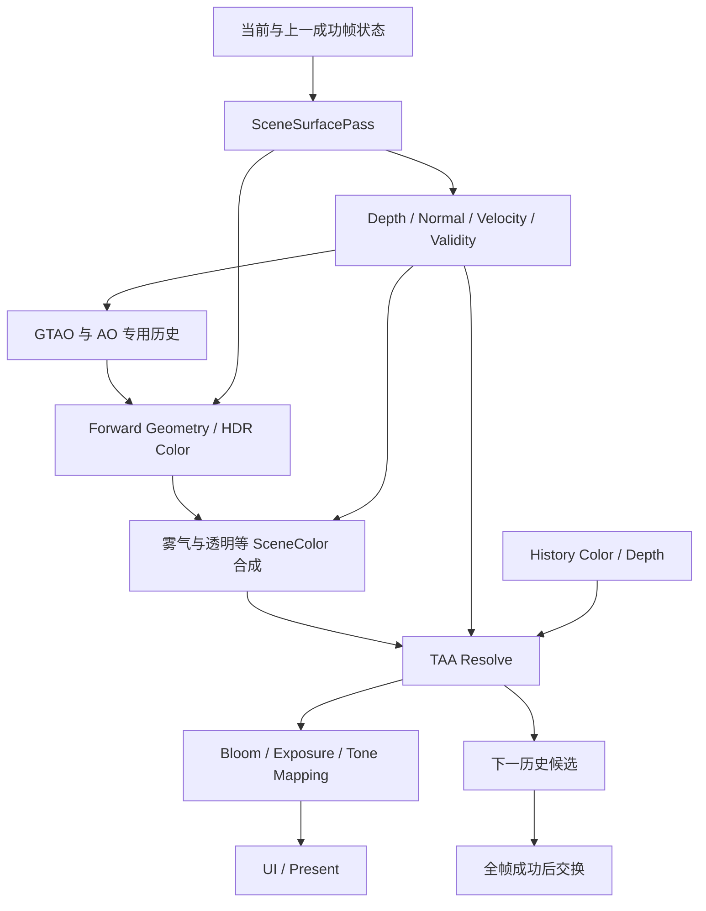

# v0.24.1：统一 Scene Buffers 与 TAA 实施指南

状态：待实施方案，不代表现有能力或发布验收结果。以 2026-09-09 工作树为依据。

## 0. 实施进度（2026-09-09）

已落地并通过 `test`、`runRender3dTemporalIntegration`、`RenderPipelineGlTest`、
`runRender3dV023Integration`、`runRender3dGtaoIntegration`：

- M0/A：`SceneBufferChannel`、`SceneBufferRequirements`、`SceneBufferView`、
  `TemporalFrameState`、`TaaSettings`、`TaaResolveInputs`、`TemporalJitter`；jitter
  符号由 `TemporalJitterTest` 对真实投影锁定，速度公式由 `SceneVelocityMathTest`
  CPU oracle 覆盖。
- B：`RenderFormat.R32F` 及 backend/Texture2D/FramebufferDescriptor/RenderGraph 映射；
  `Framebuffer.fromDescriptorSharingDepth`、`RenderGraph.shareDepthTexture`、
  `CommandBuffer.depthFunc`、外部 history 借用导入。
- C：`SceneSurfacePass` 生产 depth/normal/velocity/previous depth/validity/reactive，
  Geometry 共享深度并以 LEQUAL 只写颜色；instanced 路径使用上一帧实例矩阵。
- D：`TemporalSceneState` 按 renderer 身份保存上一成功帧 Model；Skin/Morph binding
  实现 `TemporalDrawBinding` 的上一调色板/权重快照。
- E：`TaaHistory` 双缓冲 color+R32F depth，`commitSuccessfulFrame`/`discardFrame`；
  `taa-resolve.frag` 实现第 16 节基线；HDR/LDR 两条路径；`TaaResolveGlTest` 覆盖
  H01–H05。
- G（已迁移）：GTAO 单采样路径不再渲染自己的 depth prepass；`gtao-estimate.frag`
  消费公共 `sceneDepth`/`sceneNormal`（世界法线转视空间），`gtao-temporal.frag`
  使用公共 velocity/previous-depth/validity 并做 jitter 修正；denoise/upsample
  复用公共深度。`GtaoShaderGlTest` 断言 `SceneSurfacePass` 存在且 prepass 不再出现。
- H1（已完成）：后端支持多重采样纹理（`TEXTURE_2D_MULTISAMPLE`、`sampler2DMS`
  绑定命令）；MSAA 下 `SceneSurfacePass` 输出多重采样 MRT+depth，新增
  `SceneSurfaceResolvePass` 按最近设备深度 sample 一致地取出
  normal/velocity/previous-depth/validity/reactive 与单采样深度，Geometry 共享
  多重采样深度。MSAA+Fog/GTAO 均走公共表面数据。
- H2（已完成）：`Render3dTemporalDemo` 支持 OFF/FXAA/MSAA/TAA、暂停相机、暂停动画、
  显式 `resetTemporalHistory`、resize 与 `--capture`；`runRender3dTemporalDemoIntegration`
  已注册并通过。

仍未完成（发布前必须关闭）：

- F：风动/自定义变形的"上一帧标量参数"协议与夹具；TAA 调试视图与接受/拒绝统计。
- G3：体积雾仍未接 `TemporalFrameState`，TAA 在雾区未做双重历史降权。
- H4：`SceneBuffersGlTest`、`DeformationVelocityGlTest`、`TaaHistoryLifecycleGlTest`、
  `TaaSceneRegression` 与变异测试尚未补齐。
- H5：能力矩阵、测试指南、资源清单、changelog、`temporal-baseline.json`。

### 0.1 F1–F6 修复（2026-09-09）

- F1：`SkinSceneDrawBinding`/`MorphSceneDrawBinding` 在 `discardTemporalFrame()` 中
  使 previous/current 上传缓存失效，失败帧后强制重传；`TemporalTransactionGlTest`
  用真实 GL 读回 previous palette 证明重试上传的是上一成功帧数据。
- F2：`TemporalSceneState.previousStateValid` 对无 temporal capability 的
  **变形** binding 返回 false；`SceneVelocityGlTest` 验证 MASK 孔洞与背景
  validity=0、移动 opaque 的 GPU velocity 与投影 oracle 一致。
- F3：新增 `TemporalDrawBinding.prepareTemporalCommit()` 可失败阶段，
  `RenderPipeline` 先 `prepareFrameSuccess`/`prepareFinalization` 再统一发布；
  测试注入 finalize 失败后断言 history read ID、相机 token、Model、快照与 GPU
  palette 均未推进。
- F4：`Material.temporalReactive`/`MaterialInstance.temporalReactive` + 独立
  `SceneReactivePass`（R8、additive、无深度写入）作为真实 reactive 生产者，
  `PipelineTopology` 依据材质声明/透明队列/HDR VFX 请求通道；`taa-resolve.frag`
  为背景（depth>=1）实现相机旋转方向重投影，history depth 用负值标记天空覆盖。
- F5：`TemporalSceneState` 在成功提交时按当前 membership 剪枝退出对象并使其
  previous 失效；`invalidate()` 清空快照。churn 测试验证 4→1 对象后快照回落。
- F6：`docs/licenses/assets.tsv` 补齐 7 个新 shader 并更新 2 个 GTAO shader
  的 SHA-256；新增 `Render3dTemporalBenchmarkSuite` 与
  `runRender3dTemporalBenchmarks`/`localTemporalVerification`，写入
  `build/reports/temporal/<candidate>/{manifest,metrics}.json`，并接入
  `releaseReadinessEntries` 与 GL 策略表（contracts 通过）。
- 画质验收：`Render3dTemporalQualitySuite`（`runRender3dTemporalQuality`）用同一
  确定性相机路径渲染 NONE/TAA 序列，断言抗锯齿能量比、边缘锐度比与切镜残影
  衰减；默认 480×480/40 帧实测 aliasing ratio≈0.42、sharpness ratio≈0.71、
  ghostDecay=0、收敛差=0，并写入
  `build/reports/temporal/<candidate>/quality/{metrics.json,none/,taa/}`。

仍未完成：

- 风动/自定义变形上一帧参数协议与夹具；TAA 调试视图与拒绝原因统计。
- G3 体积雾帧状态与雾区降权。
- `DeformationVelocityGlTest`、`TaaHistoryLifecycleGlTest`、`TaaSceneRegression`、
  变异测试与 `temporal-baseline.json`/能力矩阵文档。

### 0.2 CPU 预算口径修正（4K 验收）

现象：4K 下 TAA resolve GPU 1.53 ms 在预算内，但"CPU 增量"约 2 ms 超预算。

实测归因（同候选、关闭 debug group）：

| 尺寸 | recordΔ | submitΔ | wallΔ | SceneSurfacePass GPU | TaaPass GPU |
| --- | --- | --- | --- | --- | --- |
| 1080p | 0.04 ms | 0.13 ms | 0.18 ms | 0.09 ms | 0.21 ms |
| 4K（未隔离） | 0.07 ms | 1.65 ms | 1.71 ms | 0.27 ms | 1.38 ms |
| 4K（帧前 glFinish） | 0.02 ms | 0.17 ms | 0.19 ms | — | 1.81 ms |

结论：`FrameDriver.beginFrame→endFrame` 的窗口包含 `device.execute`，在 4K 下驱动
命令队列被 GPU 工作填满，GL 提交阻塞，使"CPU 时间"等于新增 GPU 时间
（surface 0.27 ms + resolve 1.38 ms ≈ submit 1.65 ms）。这不是 TAA 的 CPU 成本。

修正：
- 基准在测量帧前调用 `glFinish()` 清空队列，CPU 窗口只包含录制与提交；
- 门禁改为 **CPU 录制增量**（`recordP50`，预算 0.5 ms），submit/wall 单独报告并
  以 3 ms 作为反压 sanity 上界；
- 报告新增每 pass CPU 时间与 `recordP50Ms`/`submitP50Ms`/`cpuPasses`，
  `cpuIsolation` 字段说明口径；基准模式关闭 debug group。
- 正式门禁实测：1080p recordΔ 0.022 ms / resolve GPU 0.36 ms；4K recordΔ
  0.016 ms / resolve GPU 1.81 ms，均通过。

注意：基准场景仅 2 个对象，SurfacePass 的录制增量随对象数线性增长；发布候选
必须用与验收场景相同对象数的基准，不能直接用演示场景的 0.02 ms 外推。


阅读规则：第 1～11 节解释目标与设计；第 12～21 节是实施合同与交付清单。“必须/禁止”是本版本约束；“建议名”只允许调整命名，不允许删除相应职责。前文标为候选的调参值和预算，按第 19 节冻结后才能用于正式验收。任何范围调整都必须更新这份文档及对应测试，不能只在实现或发布说明里默默缩减。

工程师首次执行按第 12 节硬约束 → 第 13～16 节实现合同 → 第 17 节任务包 → 第 18～21 节验证与交付阅读；坐标与资源定义回查第 3 节。文中演示按钮 OFF 对应实际枚举 `AntiAliasingMode.NONE`，不能新增一个重复的 OFF 枚举。

## 1. 版本目标与范围

本版本优先建立所有屏幕空间效果共享的表面数据和历史帧协议，再把现有 TemporalAccumulation 升级为原生分辨率 TAA。保持 Forward 光照架构。

完成后的核心行为：相机或物体运动时，历史颜色跟随同一表面重投影；新显露区域、无可靠运动数据的区域和场景切换不继续混入错误历史；静止细线、植被边缘和高光的闪烁得到可验证的改善。

必须交付：

- 可按需求申请、具有明确空间与生命周期约定的 Scene Buffers。
- 相机、刚体、骨骼、Morph、风动的上一成功帧状态与有效性协议。
- 重投影、历史深度验证、邻域限制、基础 Reactive Mask 和 HDR temporal resolve。
- GTAO 对公共表面缓冲的实际迁移，以及雾气对公共深度与相机帧状态的迁移。
- 调试视图、运动场景、数值回归、资源和性能验收。

本版本不增加 SSR、DOF、Motion Blur 或 Temporal Upscaling 成品功能，不引入 Deferred 光照，也不把“所有效果使用同一张历史纹理”作为统一目标。MaterialId、ObjectId、Roughness 和 shading normal 可后续扩展；稳定对象身份的 CPU 协议现在就需要。

## 2. 当前代码的真实起点

以下为仓库相对定位路径；新类名均是建议名。

| 现有入口 | 当前情况 | 本版本处理 |
| --- | --- | --- |
| `src/main/resources/shaders/postprocess/temporal-accumulation.frag` | 同 UV 读取 current/history 后混合 | 替换为完整 TAA resolve |
| `subsystems/postprocess/TemporalAccumulationPass.java` | 只有两张颜色纹理和权重输入 | 引入结构化输入和有效性参数 |
| `subsystems/render3d/TaaHistory.java` | 单张颜色 FBO、固定有效权重 0.90 | 颜色与深度双缓冲、候选写入、成功帧提交 |
| `subsystems/render3d/CameraUniforms.java` | 已有四相位 ±0.25 像素投影 jitter | 保留基线；统一当前/上一帧矩阵和实际 jitter 偏移 |
| `subsystems/render3d/PostProcessPassBuilder.java` | HDR TAA 在 Fog 前；pass 录制中 blit 并 markValid；另有 LDR 路径 | 调整时序并分离录制与历史提交 |
| `subsystems/render3d/GtaoPasses.java` | 自有深度 prepass、半分辨率法线和历史 | 迁移公共表面输入，保留 AO 专用历史 |
| `shaders/render3d/pbr/pbr-forward.vert` | 已有当前 Model、骨骼和 Morph 数据 | 补上一成功帧变换与变形数据 |
| `backend/RenderFormat.java` | 有 RG16F/RG32F，没有 R32F | 扩展 R32F 及完整 backend 映射、分配和诊断 |
| `core/graph/RenderGraph.java` | 已有 createColors；不能反复 createColor 累加 MRT | 补齐需要的共享附件/外部历史接入能力及所有权测试 |

Java 行的根目录为 `src/main/java/com/kaleblangley/haikalat/`，shader 行的根目录为 `src/main/resources/`。

因此不能仅替换 fragment shader：Java 输入接口、资源图、场景提交、历史管理和 LDR/HDR 两条路径都要一起改。

## 3. 先冻结数据协议

### 3.1 Scene Buffers

“统一”指一个语义、一个生产者协议和明确的消费关系，不等于所有模式都分配全部纹理。

| 逻辑资源 | 首版格式建议 | 语义与采样 |
| --- | --- | --- |
| SceneColor | RGBA16F | 场景线性 HDR、曝光前；按处理阶段提供句柄，不能含糊复用同一个名字 |
| SceneDepth | 当前 D24 texture | 原始设备深度；声明投影、near/far、背景值和 sample count；禁止颜色式线性过滤 |
| LinearDepth | R32F，按需物化 | 正视空间深度 `-viewPosition.z`，单位为世界单位；不是到相机的欧氏距离 |
| SceneNormal | RG16F oct 编码 | 首版规定为世界空间几何表面法线，解码后归一化；不混入 normal map |
| SceneVelocity | RG16F | 当前表面到上一成功帧表面的无 jitter UV 偏移；定义见下文 |
| PreviousSurfaceDepth | R32F，仅 temporal 消费时 | 当前可见表面在上一帧相机中的正视深度，用于动态物体校验 |
| TemporalValidity | R8 | 0=当前表面没有可信历史对应关系，1=可尝试复用；零速度不代表有效 |
| ReactiveMask | R8，按需分配 | 0=允许常规历史，1=强烈降低或关闭历史；属于颜色响应控制 |

后续 SSR 若需要 normal map 后的着色法线，应显式申请 SceneShadingNormal；不能悄悄改变 SceneNormal 的几何语义。GTAO 消费世界法线时转换到当前视空间。

PreviousSurfaceDepth 与 TemporalValidity 是容易漏掉的首版辅助数据。只存二维 velocity，无法精确知道移动物体对应点上一帧的深度；把当前世界点乘上一帧相机矩阵只适用于静态表面。未来可压缩或合并物理附件，但先保持协议清晰。

所有资源描述必须带 extent、sample count、format、空间、有效背景约定、producer 和 generation。透明混合物体不覆盖 opaque/masked 表面的 depth/normal/velocity。

### 3.2 Velocity 与 jitter 的唯一约定

采用 OpenGL 内部纹理 UV，原点和 Y 方向与现有 SceneColor 一致，不在 shader 间隐式翻转。

```text
currentClip  = currentStableVP  * currentWorldPosition
previousClip = previousStableVP * previousWorldPosition

currentUv  = currentClip.xy  / currentClip.w  * 0.5 + 0.5
previousUv = previousClip.xy / previousClip.w * 0.5 + 0.5
velocity   = previousUv - currentUv

historyUv = currentRasterUv + velocity + previousJitterUv - currentJitterUv
```

上述 historyUv 公式约定 history 颜色/深度存储在上一帧 jitter 后的 raster 网格。若以后改为无 jitter 输出网格，必须同时修订公式、深度采样和测试，不能只删一项偏移。

`JitterUv` 指实际投影产生的 NDC 偏移的一半。不能直接假定 `projection.m20/m21` 的增量与屏幕位移同号；用已知点投影测试锁定符号。geometry、surface prepass、重建矩阵必须来自同一帧参数。

- 栅格化使用 current jittered projection，速度使用 stable projection，避免重复计入 jitter。
- 顶点传递当前/上一帧 clip 坐标，在 fragment 中做透视除法；不要直接插值顶点处已除以 w 的速度。
- previousClip.w 非正、数据非有限、对象首帧或上一状态不可信时，设置 validity=0。
- 速度用 UV 单位存储，调试与阈值可转换为像素；resize 时必须失效历史。
- 静止物体、静止相机仅 jitter 改变时，SceneVelocity 必须为零。

### 3.3 历史状态以成功帧为界

引入建议对象 `TemporalFrameState`，统一提供当前/上一成功帧的 stable/jittered VP、inverse VP、view、projection、jitter、extent、near/far、帧序号和 generation。

建议生命周期：`prepareFrame → record → execute → commitSuccessfulFrame`。异常走 discard；录制命令不等于执行成功。

`TemporalSceneState` 按稳定对象/实例 ID 保存上一成功帧的 Model、骨骼调色板、Morph 权重和风动时间。必须复制或使用不可变快照，不能持有会被下一次 update 原地改写的矩阵引用。

对象删除、ID 重用、模型替换、首次可见或上一帧无覆盖时要有显式失效规则。对象/实例 ID 不得使用排序后 draw index。动画更新次数也不能充当 rendered frame 序号。

## 4. 管线安排：先解决 GTAO 的前置依赖

当前 GTAO 结果在 Forward PBR 光照中使用。如果 normal/depth 只在最终 Forward Geometry 才产生，就会形成 Geometry → GTAO → Geometry 的循环。

首版建议采用按需求开启的统一 `SceneSurfacePass`，接管原 GTAO 深度 prepass；输出 depth、所需 normal/velocity/validity/previous depth。Forward Geometry 再计算颜色，复用这些表面数据。这仍是 Forward 光照。



实现约束：

1. SurfacePass 必须与 Geometry 共享可见性、面剔除、Alpha MASK、LOD、蒙皮/Morph/风动代码、模型矩阵和 jitter。不能用简化 silhouette 产生错误 motion/depth。
2. 建议支持把同一 depth texture 附到后续 FBO，进行只读深度测试；补齐 RenderGraph/backend 的共享附件所有权和 resize 行为。若初版暂时重复写深度，必须测量并记录，不能默认又新增一套全场景绘制。
3. 同一 texture 不得在正在写入它的 pass 内作为普通采样输入；depth 作为附件只读测试与 shader 采样是两种不同用途，需显式规避反馈冲突。
4. MRT 使用 createColors；共享附件的 close/retire 由唯一 owner 管理，不能由两个 FBO 重复销毁。
5. 没有 Scene Buffers 消费者时，不创建 SurfacePass 和辅助纹理，保留已有轻量 Forward 路径。
6. GTAO 关闭时可后续优化为 Geometry MRT，但 v0.24.1 不同时维护两套尚未验证的生产策略。

GTAO 半分辨率输入从公共全分辨率数据统一降采样：depth、normal、velocity 和 validity 必须选择同一表面代表，不能平均前后景 depth，也不能分别挑不同像素。迁移后删除原专用 depth draw 与重复 normal 重建；保留 AO 值及其 history 的算法所有权。

## 5. TAA resolve 的具体实现

### 5.1 输入与历史存储

建议 `TaaResolveInputs` 聚合当前 SceneColor、depth、velocity、previous surface depth、validity、reactive、history color/depth 和帧参数；不要继续扩展十几个裸 texture ID 的位置参数。

历史采用两组 color/depth：A 只读，B 是候选输出；成功后交换。当前 resolve 结果可以直接作为 B 的 history color，并供后处理消费，避免额外全屏 blit。HistoryDepth 必须保存与该颜色网格对应的当前线性表面深度，不是 PreviousSurfaceDepth。

B 上的颜色、深度、有效标记、相机和对象上一帧快照必须整体提交。中途失败时 A 及其 metadata 保持不变。resize/rebuild 先分配候选，再原子替换；分配失败保留原 generation。

### 5.2 历史验证

每个像素执行以下顺序：

1. validity=0 或全局历史无效，直接输出 current，不读取未初始化 history。
2. 计算 historyUv，检查有限值和采样 footprint；超出范围直接拒绝，不能 clamp 到屏幕边缘继续混合。
3. 比较 PreviousSurfaceDepth 与 historyUv 对应的 HistoryDepth。二者必须处于同一个上一帧视空间。
4. 深度误差采用 `absDelta <= max(absoluteTolerance, relativeTolerance * expectedDepth)`；单位和默认值写入配置文档。
5. 对遮挡边缘用候选 tap 校验，颜色与深度来自一致表面；不能双线性平均两块不同深度后误判通过。
6. 结合 reactive、亮度变化和速度降低历史权重。深度拒绝处理几何变化，reactive 处理不能由几何解释的颜色变化，二者互不替代。

首版绝对容差、相对容差可从 0.01 世界单位、0.01 起调，但它们是待场景验证的候选值，不是所有资产尺度都适用的发布默认值。调试视图必须显示 actual delta、threshold 和拒绝原因。

对细前景可增加邻域最近表面的速度扩张；若选择邻居速度，需连带使用该邻居的有效性和 expected previous depth，防止跨表面拼接 metadata。

### 5.3 邻域限制与融合

- 先用 current 的 3×3 邻域做 min/max clamp，建立可复现基线；再选择是否加入 YCoCg variance clipping。
- 邻域统计针对当前输入；深度边缘可排除明显不同表面，不能让背景亮色无限放宽前景 history。
- 限制的是重投影得到的 history color，然后按有效权重与 current 混合。
- `historyWeight` 始终表示历史占比。建议候选静态上限 0.90～0.95；运动、显露、reactive 区域逐步降低。
- 先使用双线性 history color；高阶重建滤波与锐化后置，避免同时引入 ringing、负值和调参变量。
- 静止收敛、运动拖影和细节保留同时验收；不能通过强 clamp 把所有历史清掉来“解决”拖影。

TAA 使用线性 HDR、曝光前颜色，Bloom 和 Tone Mapping 在其后。若未来采用 pre-exposure，历史需要按新旧曝光比例重新缩放。现有 LDR 路径也必须在明确的线性空间 resolve，不能直接平均 sRGB 编码值。

### 5.4 Reactive 与透明、天空、雾

ReactiveMask 应纳入本版本最低能力：支持材质明确声明 temporal 不可信程度，并覆盖 BLEND、ADD、粒子、变化的 emissive 等区域。Alpha MASK 植被首先需要正确的几何速度和 alpha 一致性，不能整片永久置 1 来掩盖缺失的风动速度。

透明不覆盖 opaque 深度。首版可按透明覆盖度/材质响应写保守 reactive，并降低历史；强度映射需要标定，尤其是 additive HDR 特效。Reactive 高值覆盖率纳入诊断，避免整个画面退化为无 temporal。

天空不使用清屏深度重建有限世界点；用天空方向和相机旋转重投影，忽略相机平移。天气或天空参数大改时失效天空历史或提高响应。

TAA 的 SceneColor 输入应包含计划由它处理的场景颜色合成。图中的雾与透明是逻辑合成阶段，不要求把透明强行放在雾之后绘制；保留当前透明/雾的正确光学与排序行为。UI 始终在 TAA 之后。

已有体积雾有自己的低分辨率 temporal。它沿视线积分，没有唯一表面速度，不能直接套用 opaque velocity。首版保留散射代表深度/相机重投影，复用公共帧参数和 SceneDepth；明确最终 TAA 叠加时的雾区 history 降权，测试双重历史是否拉长光束残影。

## 6. 动态场景与兼容性

| 对象类型 | v0.24.1 要求 |
| --- | --- |
| 静态网格 | 相机运动产生正确 velocity，禁止所有静态物体恒零 |
| 刚体/实例 | 当前与上一成功帧 Model，按稳定实例身份匹配 |
| 骨骼 | 当前与上一调色板计算同一顶点位置；缓存布局变化失效 |
| Morph | 当前与上一 Morph 权重都参与 position；不能只保存 Model |
| 风动植被 | 同一风动函数分别使用当前/上一成功帧时间与参数 |
| 自定义变形 shader | 提供 surface/velocity 变体或标记无可信历史；诊断显示覆盖缺口 |
| BLEND/ADD | 保守 reactive 路径；不承诺首版精确多层透明 motion |

开发阶段允许先让骨骼/Morph/风动输出 validity=0 来分阶段落地，但正式发布若演示这些对象，必须提供正确速度；不能宣称覆盖动态场景同时永久使用降级。

保持 `AntiAliasingMode.TAA` 入口，默认 AA 行为不自动改变。旧低层颜色混合 API 若被外部调用，保留并明确标注 legacy blend；不要把缺少 depth/velocity 的旧调用静默宣传为新 TAA。

首版 TAA 使用单采样，不承诺 MSAA+TAA 组合。MSAA 模式下公共缓冲仍要有明确协议：颜色可平均 resolve，depth/normal/velocity 使用最近有效表面的同一个 sample；validity/reactive 的保守合并规则单独定义。背景 sample 与前景 sample 不能直接平均。

## 7. 分阶段交付

| 阶段 | 具体改动 | 退出条件 |
| --- | --- | --- |
| M0：冻结合同与基线 | resource 语义、jitter/velocity 公式、测试相机、配置和性能指纹；记录当前颜色混合效果 | 已知点投影/速度符号测试可执行，旧候选可复现 |
| M1：Scene Buffers | SceneSurfacePass、格式/backend、RenderGraph 生命周期、只读句柄与调试预览 | depth/normal 与颜色 silhouette 一致；OFF 无额外资源 |
| M2：Temporal 状态与速度 | Camera/Object 前帧状态、刚体速度、expected depth、validity、commit/abort | 移动物体数值正确；失败不推进任何历史 |
| M3：原生 TAA | ping-pong color/depth、重投影、拒绝、邻域 clamp、HDR/LDR 路径 | 静止收敛、相机运动、显露、切镜均通过 GPU 测试 |
| M4：动态与响应 | 骨骼、Morph、风动、基础 reactive、天空与透明降级 | 角色和树林运动无明显历史拖带，降级覆盖可见 |
| M5：消费者迁移 | GTAO 使用公共 depth/normal/velocity；Fog 共享 depth/frame state | 无重复 GTAO 深度绘制；AO/体积的独立历史仍正确 |
| M6：性能与发布 | 长预热、多轮 A/B、场景视频、失败注入、完整门禁 | 同一候选证据齐全才发布 |

M1～M3 是首个可演示里程碑；M4～M6 是 v0.24.1 完整交付条件。不能在 M3 把这个版本标成完成。

已有 GTAO 积分修复应保留。前次验收留下的共享阴影分支内导数和法线断层测试缺口，要在 M0 的基线清单中单独列出并在发布前关闭，避免把它们的闪烁误诊为 TAA 问题。

## 8. 验收用例与调试工具

新增建议测试名为规划，不是当前可运行测试。

| 类别 | 场景与断言 |
| --- | --- |
| SceneBuffersGlTest | 几何轮廓、MASK 孔洞、背面剔除、背景、奇数尺寸、1×1、MSAA sample 一致性 |
| SceneVelocityGlTest | 已知相机平移/旋转与物体平移/旋转；实际 GPU UV 偏移对照 CPU 投影；仅 jitter 时速度为零 |
| DeformationVelocityGlTest | 独立骨骼、Morph、风动运动，Model 不变时速度仍正确 |
| TaaResolveGlTest | 人工 color/depth/velocity 的精确重投影、越界/遮挡拒绝、亮色 history 被邻域限制、reactive=1 抑制历史 |
| TaaHistoryLifecycleGlTest | 切镜、resize、FOV/near/far、scene replacement、热重载、失败注入；检查提交前后的读写纹理及 metadata |
| TaaSceneRegression | 黑白细线、棋盘格、移动方块露出背景、斜墙、旋转高光、行走角色、风动叶片、粒子与光束 |

数值测试必须覆盖非对称输入，检查真正的边缘像素，显式设 viewport 和真实投影。至少对错误 velocity 符号、取消深度拒绝、恢复同 UV 混合做变异测试，证明测试能失败。

演示入口建议 `runRender3dTemporalDemo`：可切换 OFF、旧颜色混合、新 TAA；暂停相机但继续动画、暂停动画但移动相机；一键 reset history；录制固定路径。

调试视图至少包括 color、device/linear depth、normal、velocity 方向/像素幅度、validity、reactive、historyUv、history weight、rejection reason。统计 history 接受率、每类拒绝率、无 velocity 覆盖率、reactive 高值覆盖率和资源字节数。

画质验收保存同一路径的序列或视频，不能只凭静态截图。参考可采用离线高采样/高分辨率降采样图；比较静态方差、边缘锐度及显露后残影衰减，测试阈值在 M0/M3 基于固定场景冻结。

## 9. 性能和内存合同

先测分项，再设正式门槛，禁止直接套用不同 AA/分辨率配置的旧基线。每份结果记录 GPU/driver、Java、候选与 shader hash、尺寸、AA、jitter、对象数、动画数、所有效果开关、预热/测量帧数。

分别比较：基础 Forward；仅 Scene Buffers；Scene Buffers+TAA；再加 GTAO；再加体积雾。记录 CPU 录制/提交、每个 GPU pass、整帧开关增量、draw 数、带宽估计和峰值显存。

建议长测为每组合 5 轮、预热至少 120 帧、测量至少 300 帧，串行执行 GPU 场景；保留现有正式 benchmark 合同，不用长测替代或放宽正式门禁。

以未压缩、未做资源别名的首版方案估算：新增 normal/velocity/linear depth/previous depth/validity/reactive 为 18 B/像素，两组 RGBA16F color+R32F history depth 为 24 B/像素，共 42 B/像素。约为 1080p 83.1 MiB、4K 332.2 MiB；不含已有 SceneColor/SceneDepth、MSAA、AO/体积 history 和 driver 对齐。注意这些是规划估算，不是实测分配。

资源复用后重新计算实际峰值：LinearDepth 与 history write depth 可在生命周期允许时别名，TAA 输出直接作为 history write；删除旧单颜色 history 与 GTAO 专用重复资源。不能一边保留旧链一边只报告新链的字节数。

M0 可设候选目标：OFF 路径无新 draw/附件/稳定分配；新增 TAA resolve GPU 不超过 1080p 1 ms、4K 3 ms；这些是待目标硬件验证和冻结的预算，不是已通过的结论。SceneSurfacePass、动画快照和 consumer migration 成本必须另外报告。

## 10. 最终完成定义

- [ ] 公共 buffer 的格式、空间、采样、extent、生产者和生命周期可查询。
- [ ] 相机与全部内建动态变形具备可信 velocity，动态 previous depth 校验正确。
- [ ] TAA 完成重投影、历史校验、邻域限制、reactive 和 HDR resolve。
- [ ] 历史只在成功帧整体提交，resize/rebuild/失败可回滚。
- [ ] GTAO 和 Fog 实际消费公共数据，没有影子实现继续重复生成。
- [ ] 天空、透明、植被和双重 temporal 行为有明确边界及运动验收。
- [ ] AA OFF/FXAA/MSAA/TAA、HDR/LDR、自定义材质兼容矩阵有证据。
- [ ] 数值、画质序列、长测与正式性能门禁都对应同一候选。
- [ ] 文档、资源清单、能力矩阵与发布说明反映实际结果。
- [ ] 最后执行 check、完整 glSmoke、GTAO 与户外验证，以及 releaseReadiness。

## 11. 技术参考

- [A Survey of Temporal Antialiasing Techniques](https://research.nvidia.com/labs/rtr/publication/yang2020survey/)：理解采样积累、重投影与历史验证的职责划分。
- [NVIDIA Temporal Supersampling](https://developer.download.nvidia.com/gameworks/events/GDC2016/msalvi_temporal_supersampling.pdf)：邻域 clipping/variance 的设计参考。
- [AMD FidelityFX Temporal Super Resolution 集成文档](https://github.com/GPUOpen-LibrariesAndSDKs/FidelityFX-SDK/blob/main/Kits/FidelityFX/docs/techniques/super-resolution-temporal.md)：motion、jitter、depth、reactive 的输入约定参考。v0.24.1 只实现原生 TAA，不能把该 SDK 的整个算法与性能承诺直接搬过来。

## 12. 实施硬约束：评审时逐条检查

| 编号 | 必须满足 | 不可接受的替代 |
| --- | --- | --- |
| SB-01 | 全局统一表面资源语义；消费者只借用当前 generation 的句柄 | GTAO、TAA、Fog 各自再渲染同一份 depth |
| SB-02 | surface 与 color 使用同一份 SceneFrame 可见对象、变换和变形状态 | 各 pass 再调用一次动画更新或重新读取可变 Scene |
| SB-03 | 只有需求变化才重建资源拓扑 | 根据某帧是否有移动物体而逐帧创建/销毁 velocity |
| MV-01 | velocity 的方向、单位、jitter 网格协议完全符合第 3 节 | “看起来向右就把符号翻一下” |
| MV-02 | 内建动态变形使用前后两套顶点状态 | 相机重投影冒充骨骼、Morph 或风动速度 |
| MV-03 | 无可信历史必须显式无效 | 清零 velocity 后把 validity 标成有效 |
| TP-01 | color/depth/frame/object 状态只在成功帧一致提交 | 在 recorder 内 markValid、交换 history 或推进 previous Model |
| TP-02 | 失败时不覆盖上一份有效 history | 先写 read history，出错后只把 valid=false 当回滚 |
| TA-01 | 历史采样与深度验证指向同一个表面 | 用平均 depth 验证一份跨边缘混合的 history color |
| TA-02 | 无效历史完全走 current 分支 | 读取未初始化 history 后乘 0，任由 NaN 传播 |
| TA-03 | 静止/运动质量都达标，reactive 有覆盖统计 | 全屏 reactive=1 或 historyWeight=0 来获得“无拖影” |
| CP-01 | NONE/FXAA/MSAA 的原有行为有回归证据 | 所有效果关闭时仍常驻完整 temporal 资源 |
| CP-02 | 内建 PBR、shadow-budget、实例及内建变形路径一致支持 | 只让一个演示使用的 shader 变体工作 |
| RL-01 | 原有正式门禁保留，新预算单独可追踪 | 修改旧 baseline、扩大容差或增加豁免使结果变绿 |
| RL-02 | 实测结果对应候选指纹 | 用上一个 candidate 的 readiness 文件替代本次报告 |

本项目已经存在某些效果专用历史和相机矩阵逻辑。统一工作应迁移它们的公共输入，不应将 RenderPipeline 改成另一套独立渲染框架，也不应新增只服务演示的平行生产代码。

## 13. 文件级职责与接口边界

### 13.1 在现有模块内分工

| 修改入口 | 工程任务 | 必须保留的边界 |
| --- | --- | --- |
| `RenderPipeline.execute` 与场景 snapshot 流程 | 准备帧 token、冻结前后状态、执行图后协调提交/失败 | 复用现有 SceneFrame；不能由 TAA 再遍历一个可变 Scene |
| `PipelineGeneration` | 持有该 generation 的 Scene Buffers、pass、历史 owner；参与候选 resize/close | 旧 generation 退役后消费者不能继续使用其 GL id |
| `ForwardPassBuilder` | 根据需求接入 SurfacePass，共享 depth 并保留 Geometry→GTAO 前置关系的正确方向 | Geometry 不得读自己正在输出的 AO/normal |
| `PostProcessPassBuilder` | 组织颜色阶段、TAA 输入、历史候选输出与后处理依赖 | 不在 pass callback 提交历史；保留 HDR/LDR 两条受测路径 |
| `CameraUniforms`、`CameraProjection` | 从统一 frame state 上传 current jittered camera | 不另维护一个不一致的 jitter phase |
| `SceneDrawBinding` | 扩展表面/velocity 所需的当前及前帧变形绑定协议 | 不打破 SHADOW 与 DEPTH_PREPASS 的现有用途 |
| `gltf/SkinSceneDrawBinding`、`MorphSceneDrawBinding` | 绑定前帧 palette/weights，有效性与布局 revision | 前帧缓存由成功帧协议推进，不能在 draw 时覆盖 |
| `GtaoPasses`、`GtaoHistory` | 删除重复表面生产，复用公共数据；AO history 保持独立 | 图中不得残留原 GTAO depth draw 的实际执行 |
| `OutdoorVolumetric*` | 接公共 camera/depth 与 reset 协议 | 保留散射代表深度，禁止使用 opaque velocity 代表整条光线 |
| `RenderGraph`、Framebuffer/backend | 共享附件、外部 history 绑定、R32F、格式统计和生命周期 | 先验证资源图与 FBO 合法性，再允许 GPU 执行 |
| `Render3dDiagnostics`、preview | 资源、速度覆盖、拒绝原因和阶段性能 | 不只打印一个总耗时然后声称优化完成 |
| `gradle/demo-tasks.gradle`、release verification | 注册新测试/演示/报告生产任务并接入正式门禁 | 不能只有手工运行入口，releaseReadiness 不覆盖它们 |

表内类在第 2 节所述 Java 根目录内，backend/core 类按其包目录定位。

### 13.2 建议新增的最小职责对象

以下是职责合同，不要求逐字采用类名；优先 package-private，只有确有外部消费需求的接口才公开。

```text
SceneBufferRequirements
  required channels + sample policy + temporal capability requirements

SceneBufferView
  generationId, frameToken, extent, samples, encoding
  typed read-only handles; no close(), no allocation

TemporalFrameState
  immutable current frame parameters + last successful frame parameters

TemporalSceneState
  stable object/instance identity -> committed deformation snapshots

TaaSettings
  validated runtime parameters; no GL ownership

TaaHistory
  read set + candidate write set + commit/abort + resize candidate

TaaResolveInputs
  current scene handles + history read handles + frame parameters + settings
```

禁止把 SceneBufferView 变成保存裸纹理 ID 的全局 singleton。外部插件若获得借用视图，只能在约定的图执行/帧期间使用；缓存旧视图再次消费必须可诊断地失败，而不是偶然访问已复用的 GL id。

Settings 构造时校验 finite/range；例如 historyWeight 在 [0,1)，深度绝对容差非负、相对容差非负、两者不能同时无意义地关闭校验。禁止 shader 用 clamp 默默掩盖非法 Java 配置。

`SceneDrawBinding` 是现有 public 接口，目前 Pass 为 FORWARD/SHADOW/DEPTH_PREPASS。扩展 previous 数据宜通过可选能力接口或保持兼容的 default 方法，不得直接新增抽象方法令所有外部实现无法编译。任何新增 Pass 都要检查既有 switch 的处理；不能假定旧 DEPTH_PREPASS 绑定已经提供前帧 palette。外部实现不具备新能力时按第 20 节明确降级或拒绝。

### 13.3 Shader 与绑定规范

- 建立当前/前帧 position evaluation 的共享实现或生成机制，并复用于 surface/color。工程师先核对项目已有 shader 生成与资源流程，不直接引入第二套 include 编译器。
- 枚举实际占用的 UBO/SSBO/sampler binding；现有 PBR 顶点 shader 已占用骨骼 7、Morph delta 8、Morph weight 9 的 SSBO binding，新增 previous 数据不得冲突。
- 将 shader 输出位置写进一个附件布局合同。关闭某通道时仍需匹配 draw buffers 和 shader variant，不能随意移动 location 使 Java 绑定错位。
- capability 检查至少包括 draw buffers、color attachments、texture units、SSBO binding、格式 renderability；GL 4.6 版本字符串不能替代具体布局合法性检查。
- background clear：velocity=(0,0)、validity=0、reactive=0、normal 为约定默认编码；线性深度可清为 far，但 background 必须另由 SceneDepth/coverage 判定，不能把 depth==far 当唯一有效性判断。
- 对 normal 的比较先 decode；velocity/depth/validity 不能启用 sRGB 转换。运行结果必须检查 finite；NaN 的处理原因要可统计。

## 14. 资源申请、时序和状态恢复的精确要求

### 14.1 需求由消费者合并，不能由任意 pass 自行分配

| 配置 | 最低公共需求 |
| --- | --- |
| 无屏幕空间消费者 | 保留原 Geometry 路径，无新增公共附件 |
| 只有普通 Fog | SceneDepth，能直接读取则不额外生成 LinearDepth |
| GTAO，temporal 关闭 | SceneDepth + SceneNormal；算法内部的降采样结果不冒充第二套 Scene Buffer |
| GTAO，temporal 开启 | 上述 + velocity/previous surface depth/validity，用于表面历史 |
| TAA | SceneDepth + velocity/previous surface depth/validity + color/history；normal 可按其他消费者需要申请 |
| TAA + 透明/粒子 | 再申请 ReactiveMask 并有真实生产者 |
| 体积 temporal | SceneDepth + frame state；它自己的代表深度属于效果内部数据 |

Reactive 没有生产者时允许绑定统一的零纹理；validity 没有可靠生产者时不能绑定全 1 纹理。需求集合变化参与 topology revision，在已有 rebuild 事务中处理。

### 14.2 首版图必须能打印以下关系

```text
Surface -> GTAO -> Geometry -> scene-color effects -> TAA -> post -> UI/Present
Surface -> Geometry depth attachment
Surface -> TAA depth/velocity/previous-depth/validity
TemporalHistory.read -> TAA
TAA -> TemporalHistory.write candidate
```

GTAO 关闭时省略其节点；TAA 关闭时省略 TAA 和 TAA history。阴影仍在 Geometry 所需的前置阶段，不因本次工作被重做。

SurfacePass 使用深度写入；后续 opaque/masked Geometry 复用 depth 时关闭写入并使用经验证的比较方式。若选择 EQUAL，必须证明顶点、alpha、样本位置完全一致；若选择 LEQUAL，则仍不得意外让不在表面缓冲里的片元污染颜色。透明队列保留只读 depth test 和正确排序。

Depth clear 只由其首个生产者执行。借用已有 depth 的 Geometry FBO 不能沿用默认 clear 把它清掉。共享附件 size/samples 不一致必须在 prepare/build 阶段失败。

对 framebuffer sRGB、blend、depth mask/function、viewport、draw buffers 的变化必须服从现有 CommandBuffer 状态管理；不要在 pass 外用裸 GL 临时修状态，造成后续 UI 或 VFX 随机异常。

### 14.3 MSAA 处理约定

首版不组合 TAA+MSAA，但 GTAO/Fog 在 MSAA 下仍必须工作。引入单独 SurfaceResolve：对有几何覆盖的 samples 选择设备深度最近的 sample，并把该 sample 的 normal、velocity、previous depth 和 validity 一起取出；当前非 reversed-Z 的“最近”对应最小有效设备深度。

保留 mask/coverage 区别：全部为背景时输出背景；不能用零 velocity 判断 sample 是否覆盖。Reactive 采用保守覆盖合并，颜色采用独立的常规 MSAA resolve。若后续采用 reversed-Z，修改该选择规则并由投影协议驱动，不能硬编码复制一份。

## 15. 成功帧事务与失效矩阵

### 15.1 唯一提交点

现有 `RenderPipeline` 已在 `generation.graph.execute(...)` 后调用 `postProcess.frameSucceeded()`，而旧 TAA 在录制回调里 markValid。应把新 temporal 提交接到前者的统一成功路径，并移除后者行为。

```text
prepare token N:
  A = committed history + committed camera/object metadata
  B = writable candidate, distinct from A
  freeze SceneFrame and current deformation snapshots

record/execute:
  read A, write B; never modify committed metadata

prepare finalization:
  check all participating temporal owners can commit token N
  complete operations that may fail before publishing the token

commit:
  publish B + current camera/object metadata as one successful frame
  do not allocate or perform failure-prone resource creation here

abort:
  discard candidate publication; A remains the only valid read state
```

成功指本项目图执行及已定义的帧完成检查成功，不要求每帧 glFinish 等 GPU 全局等待。context loss 或已确认的异步设备错误应使整套历史失效；不能承诺保留已丢失的 GPU 内容。

资源 resize 的 prepare 失败、某个 pass 抛异常、后处理失败，都不能推进相机 previous、动画 previous 或 jitter 成功序号。复用现有全局 frameIndex 作诊断可以，但 temporal 必须明确是否使用独立的 successfulFrameIndex，不能混用。

### 15.2 每类变化的处理

| 事件 | TAA | 公共状态 / 其他效果 |
| --- | --- | --- |
| 普通相机平移/旋转 | 重投影，不全局 reset | 更新 current，success 后提交 previous |
| 刚体/动画正常运动 | velocity + 深度验证，不全局 reset | 不能继续每次 TRANSFORM_MODEL 都清空全部 AO 历史 |
| 显式 camera cut/teleport | 全局无效 | 统一通知 AO/体积等相关历史 |
| resize、render extent/sample/AA 切换 | 全局无效并事务重建 | extent 与 jitter 同时更新 |
| 首版 FOV/near/far 或投影类型改变 | 全局无效 | 后续支持连续变焦重投影需另加合同 |
| 对象新增/删除或 ID 复用 | 局部无效与深度拒绝 | 新对象 previous=current 也必须 validity=0 |
| 模型/骨骼布局/Morph layout 替换 | 对象局部无效 | 删除旧布局 previous snapshot |
| 正常材质颜色/灯光变化 | 响应/邻域限制；必要时局部 reactive | 不把相同深度当颜色永远可信 |
| 大规模 IBL/天空替换、场景替换、shader 热重载 | 保守全局 reset | 原因枚举进入 diagnostics |
| 帧执行失败 | 保留上次成功 A，候选不发布 | 所有参与状态一起 abort |
| 窗口最小化、extent=0 | 不分配、不提交空帧 | 恢复后按 extent/时间间隔合同 reset |

自动 camera-cut 阈值可作为补充，必须同时有显式 reset API；不得依赖矩阵元素绝对差的单一魔数来涵盖所有相机和世界尺度。

## 16. 可直接照着实现的 resolve 基线

以下算法顺序为首版基线；质量优化必须在它通过后另行对比。

```text
current = sample current linear color
if global history invalid or surface invalid:
    output current; output current depth; stop

uvHistory = rasterUv + velocity + previousJitterUv - currentJitterUv
if non-finite or history sampling footprint outside extent:
    reject(BOUNDS_OR_NONFINITE)

expectedZ = previous surface depth at the SAME current surface sample
for each of the four history candidate taps:
    accept tap only if finite, covered, and its depth matches expectedZ
    accumulate history color with bilinear weight only for accepted taps
if accepted weight is zero:
    reject(DEPTH_OR_DISOCCLUSION)
history = accumulated color / accepted weight

lo, hi = current 3x3 neighborhood bounds
historyLimited = clamp(history, lo, hi)
weight = baseHistoryWeight * (1 - reactive) * configured confidence terms
result = mix(current, historyLimited, weight)
write result + CURRENT linear depth to candidate set
```

背景/天空单独按第 5.4 节处理，不进入“无 surface 就永远 current”的普通几何分支。只要 history 中存在天空与几何混合，tap 必须检查 coverage 类别；可以从保存的背景标记实现，也可用明确不会与有效几何混淆的 depth 编码。若需要额外 history coverage 纹理，补记内存，不能隐藏资源成本。

深度 tap 校验之后再归一化颜色权重；禁止先硬件双线性过滤深度再比较。首版不强求额外 depth dilation，但一旦加 velocity dilation，就必须一起携带同一表面的 expected depth 和 validity。

对于 zero weight、非有限 HDR color、非法 normal 等情况，定义确定的 fallback 与计数；不要把画面异常都转换为黑色。当前颜色本身非法应作为渲染错误报告，不能宣称 temporal 修复了源数据问题。

Reactive=1 的合约为当前像素不复用历史；reactive=0 不强制复用，仍由几何验证决定。权重变化必须可从调试视图还原，不允许 shader 中埋未公开的固定 0.90 或 0.95。

## 17. 工程任务包与评审清单

每个任务包至少形成一个可独立审查的提交或 PR，顺序按依赖执行。任务名可调整，产物不能省略。

| 任务包 | 内容 | 必交证据 |
| --- | --- | --- |
| A：合同与 oracle | 固定枚举语义、encoding、jitter 公式、成功帧 token；冻结 M0 场景 | 坐标转换单测，配置 manifest，未修改旧 baseline 的 diff |
| B：backend/graph | R32F；共享 depth；历史资源借用；MRT 布局；候选 resize | FBO 完整性、sample/size 不匹配拒绝、双重释放和失败回滚测试 |
| C：Surface 生产 | opaque/masked/instance 路径；需求合并；depth/normal 调试视图 | 颜色/表面轮廓差异图；OFF 无新增 draw/附件 |
| D：刚体 temporal | previous Model/camera；velocity/expected depth/validity | 静态 jitter、相机运动、刚体运动的 GPU 数值结果 |
| E：resolve/history | 首版 resolve、ping-pong、统一 commit、HDR/LDR | 人工输入 GPU oracle；abort 后 A 内容和 metadata 保持一致 |
| F：动态与 reactive | skin/morph/wind、透明/天空/VFX | 三类独立变形用例；覆盖率统计；连续运动视频 |
| G：消费者收敛 | GTAO/Fog/volume 公共数据迁移；调整原全局 transform reset | 图拓扑、draw count、效果数值与运动回归 |
| H：发布闭环 | 完整测试、性能矩阵、文档和发布任务依赖 | 同一候选全部报告及失败原因记录 |

每个 PR 描述需回答：改变了哪个可观察行为；数据来自哪个 producer；成功/失败时谁拥有资源；新增测试能拦截哪种错误；OFF 和相关消费者的成本是什么。不接受只写“重构 temporal foundation、测试通过”。

合入新链后删除已迁移的旧生产逻辑；短期兼容分支必须有明确调用者、退出条件和测试。不得永久保留两套同名含义不同的 SceneDepth 或 previousCamera。

## 18. 数值与生命周期测试的具体输入

### 18.1 测试夹具

固定基础尺寸 64×64、奇数尺寸 65×37 和 1×1；真实透视相机 FOV=60°、near=0.1、far=100；另有正交投影夹具验证显式支持或明确拒绝。所有 GL 测试显式设 viewport、draw buffers 和 framebuffer。

CPU oracle 使用 double 精度独立投影/积分；GPU 读回实际生产 shader 的结果。不能仅在 JVM 重写同一个公式，或者检测 shader 包含某个字符串就判定算法正确。

### 18.2 必须覆盖的断言

| ID | 构造 | 断言 |
| --- | --- | --- |
| V01 | 相机/平面静止，走完 jitter 序列 | velocity 为零；非零的是显式 jitter correction |
| V02 | 点在 z=-5，物体平移已知 x 距离 | prevUV-currentUV 与 CPU 投影一致；左右运动都测 |
| V03 | 物体静止，相机旋转/平移 | 每个被测像素的速度都来自相机变化 |
| V04 | 相机与物体同时运动 | 验证组合变换，不能简单相加两个屏幕位移 |
| V05 | Model 不变，仅骨骼/Morph/风动变化 | 受影响顶点速度非零，不受影响区域接近零 |
| D01 | 当前表面上一帧深度=5，history depth=10 | 拒绝历史，即使颜色相同 |
| D02 | 动态物体从 z=-5 移到 z=-4 | expected depth=5；不能误用当前深度=4 拒绝正确历史 |
| D03 | 断层位于 x=31/32 | 检查 x=30、31、32、33，前后景 history 不混合 |
| H01 | 中心 current=0.25、有效 history=0.75、weight=0.8；邻域含 0 与 1 | 输出 0.65，避免被 clamp 测试条件掩盖混合 |
| H02 | 延用 H01，validity=0 或 reactive=1 | 输出 0.25 |
| H03 | current 邻域全为 0.25，history=10 | clamp 后输出 0.25 |
| H04 | history UV 在边界外，纹理边缘存明显异色 | 输出 current；不吸入 clamp-to-edge 的异色 |
| H05 | 当前颜色 4.0，history 有效 | HDR 值不能被无意截断到 1.0 |
| F01 | 首帧读取侧分配但未初始化 | 不读取未初始化 history；输出 current，计数为首次无历史 |
| F02 | TAA 已写 B，后续 pass 注入失败 | read A 的 ID、内容、camera/object token 不变 |
| F03 | resize 时第 2 个附件分配失败 | 原 generation 可继续渲染，新候选无泄漏 |
| F04 | 删除对象后重用内部槽位 | 新身份 validity=0，不继承旧对象快照 |

初始数值容差：R32F depth 采用绝对与相对误差组合；R8 结果至少考虑 1/255 量化；RG16F velocity 以转成像素后的误差报告。不能统一给所有断言套 0.1。每项容差需由格式量化/计算精度说明，并在基线报告列出。

必须至少执行以下变异检查：把 velocity 取反、删掉 jitter correction、把 expected previous depth 改为 current depth、让 validity 永远为 1、恢复同 UV history。对应测试应失败；否则说明测试没有覆盖所声称的能力。

## 19. 性能门槛与报告冻结方式

### 19.1 先记录配置，再运行

新增建议 `temporal-baseline.json`，随评审记录保存以下字段：candidate/source hash、shader hashes、hardware/driver、Java、extent、AA/samples、HDR、jitter sequence、effects、scene revision、object/instance/animated counts、warmup、measured frames、rounds、budget source。

第 9 节的 1 ms/3 ms 是候选目标。M0 的退出条件是给这些目标确认适用 GPU、计时范围和统计方式，或以明确证据修订并记录原因；不能一直保留“以后再定”直到发布。现有 GTAO 正式门槛继续独立生效。

报告必须分开列：SurfacePass、SurfaceResolve、LinearDepth conversion、TAA resolve、history copy（如有）、GTAO、体积、整帧 GPU；CPU 分开列快照、录制、提交和稳定分配。缺少 GPU timer 数据时标记 unavailable，不能用 CPU wall time 填充。

OFF 对照必须在同一机器与同一内容配置运行。普通颜色渲染已需要的 SceneColor/Depth 不算新增，但 previous 变形 GPU buffer、history coverage、候选 resize 的峰值重叠必须计入新增和峰值。

### 19.2 失败判定

- 任何正确性断言失败：任务包不能完成，禁止先靠画面主观评审放行。
- GPU/CPU 指标超过冻结预算：保留原失败报告，定位 producer/consumer 成本；不得只取最好一轮。
- 单次短测通过而重复长测不稳定：结论写“未稳定通过”，不能抹去失败。
- 画质靠全局清历史才能过：属于功能失败，不属于参数调优成功。
- fallback 覆盖内建必测对象：M4 未完成；自定义材质的显式支持边界另计。
- 拥有旧 readiness 文件但候选不一致：不算证据，必须重新生成。

## 20. 兼容矩阵与明确的降级行为

正式报告必须填写每一行的 supported/degraded/rejected 状态和测试入口，不能只列“全部支持”。

| 路径 | 本版本预期 |
| --- | --- |
| 原 AA OFF/FXAA，无新增效果 | 保持原功能与成本合同 |
| MSAA + GTAO/Fog | 使用一致的表面 resolve，效果正确 |
| TAA + HDR | 完整新链 |
| TAA + 非 HDR | 线性空间 resolve，最终正确编码；可内部使用浮点颜色 |
| PBR 基础/shadow-budget、opaque/masked/instanced | 内建完整支持 |
| skin/morph/wind | 内建完整支持，含 previous 变形 |
| 外部相机/嵌入式 PresentationTarget | 使用宿主帧尺寸和相机，history 按管线/视图隔离 |
| 自定义变形且能提供当前 surface、不能提供 previous | 明确 validity=0 的降级与诊断，不假造速度 |
| 自定义 opaque shader 连当前 surface 都无法一致生产 | 在请求相关能力时明确拒绝或要求适配；禁止悄悄忽略其 depth |
| 半透明多层精确 velocity | 不承诺；保守 reactive，保持排序和 opaque surface |
| TAA+MSAA、动态分辨率 temporal upscale | 不纳入首版；配置层明确禁止或解释现有互斥枚举 |

“非 HDR”不代表允许 sRGB 数值直接混合；“降级”不代表不报告。需要转换 pass 或额外纹理时记入性能和资源图。

多窗口/多视图不允许共享一个 previous camera。若一个管线实例只支持单视图，应在 API 文档说明，并对同帧交替使用两个相机给出重置或拒绝行为。

## 21. 工程师执行顺序与交付目录

1. 阅读现有 frame snapshot、generation resize、SceneDrawBinding 和 release contracts，列出与本合同的差距；不要先写 TAA shader。
2. 完成任务 A 的数据协议与基线，审查坐标方向、空间、资源预算是否唯一。
3. 按 B→C→D→E 落地；每个阶段先跑本阶段数值/生命周期检查，再继续下一阶段。
4. 完成 F 的三个变形路径与 reactive，保存固定运动序列。
5. 完成 G，核对旧 GTAO prepass 已无实际 draw；公共资源有且只有一个约定生产者。
6. 完成 H；最终候选冻结后运行完整门禁。代码再改变则对应证据失效，重新运行受影响检查。

建议新增任务名：`runRender3dTemporalDemo`、`runRender3dTemporalIntegration`、`runRender3dTemporalBenchmarks`。这些目前是待实现入口，必须实际注册并接入发布依赖后才能写进“已通过”的报告。

开发阶段使用现有 Gradle `test`/`glSmoke --tests ...` 运行实际新增类；最后执行 `check`、完整 `glSmoke`、`runRender3dGtaoIntegration`、`runRender3dGtaoBenchmarks`、`localOutdoorVerification` 及新增 temporal 正式任务。版本、候选与暂存要求准备完毕后，才执行对应版本的 `releaseReadiness`。不得提前改版本或创建标签来表示实施完成。

建议报告产物：

```text
docs/performance/v0.24.1-temporal-<date>.md       # 审查摘要，标明通过/失败
build/reports/temporal/<candidate>/manifest.json
build/reports/temporal/<candidate>/metrics.json # 分项 p50/p95、资源与覆盖
build/reports/temporal/<candidate>/images/      # 带模式/帧号的无损图
build/reports/temporal/<candidate>/sequences/   # 固定相机/动画序列
build/reports/temporal/<candidate>/failures/    # 失败注入与未通过记录
```

文档至少同步本指南、能力矩阵、测试指南、材质/阴影与户外指南、资源清单和 changelog。完成项必须附实际测试或报告入口；不允许仅将本文件所有 checkbox 自动勾选。

最终验收陈述应能够具体说清：“哪些表面有正确 motion，哪些历史被拒绝，哪条链删除了重复工作，失败后保住了什么状态，在什么配置与硬件上达到什么指标”。如果只能说“现在有了五张纹理和一个 TAA shader”，本版本没有完成。
