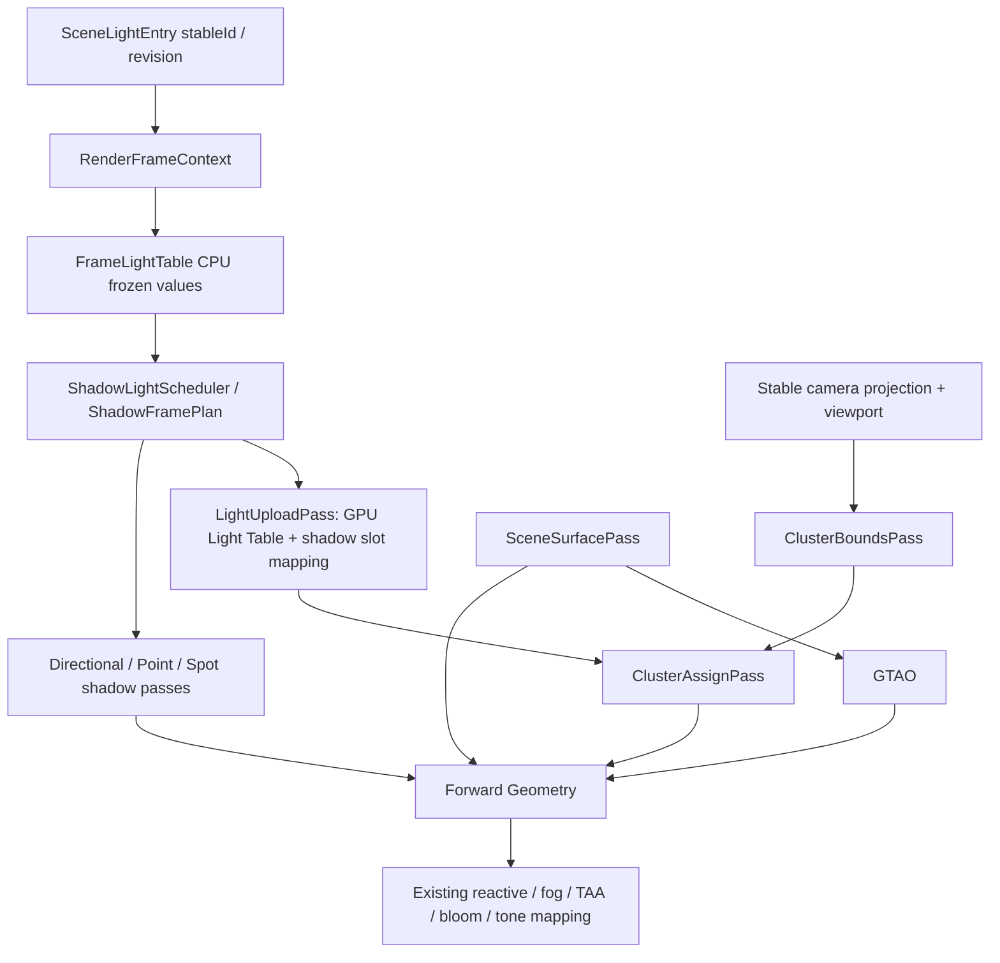

# v0.24.2 Clustered Forward 实施规划书

日期：2026-09-10。基线：`4f261b2` / `v0.24.1`。

状态：核心已实现（未发布候选）。本文件的容量、预算与阈值仍是目标；性能偏差记录在
`docs/performance/v0.24.2-clustered-forward.md`，未达标的预算不得标记为通过。

本版本的第一目标是让夜间小镇中数百个局部灯正确、稳定地参与照明，并使像素主要支付附近灯光的成本。采用 OpenGL 4.6 Compute + SSBO 的 Clustered Forward，保留 Forward 材质与共享 Scene Buffers。允许破坏内部和公开 API，不保留旧数组照明兼容路径；仓库内全部调用者必须在同一版本完成修改。

## 1. 冻结范围和完成定义

### 1.1 必须交付

1. Point / Spot 进入统一 GPU Light Table，由 compute 生成三维 cluster 的灯索引。
2. Directional 使用同一 Light Table 的全局区间，不进入空间分簇。
3. 正式 PBR 的 opaque、MASK、BLEND、skinning、morph、instancing 都使用同一灯光协议。
4. 灯光身份与阴影 atlas slot 解耦；第 9 盏 Point、第 5 盏 Spot 仍可正常照明和竞争阴影预算。
5. 灯数变化不重建 RenderGraph topology；resize、投影变化、多视口和失败重试有明确生命周期。
6. 有上限、有诊断、有正确降级，任何容量限制都不得静默丢灯。
7. 灯光实验室、夜间小镇、压力场景三个 demo 共享生产渲染管线；提供数值、视觉、性能证据。
8. 删除 LightingBinder、旧局部灯数组、旧双 PBR 照明实现和对应截断测试。

### 1.2 本版不做

- Deferred、SSR、DOF、Temporal Upscaling、自动曝光重新调参。
- 新的阴影算法、无限阴影灯数、Probe 混合、Decal 投影或局部灯体积散射成品。
- 为尚不存在的第二个空间消费者创建通用 ECS、插件系统或 `SpatialInfluenceManager<T>`。
- 依靠上一帧列表或 CPU 读回，决定当前帧应该显示哪些灯。

现有体积阳光继续工作，但不会因为表面接入 Clustered 就自动支持 Point/Spot 体积光。空间基础预留复用接口，第 15 节说明后续扩展。

### 1.3 项目原则

- `RenderPipeline` 只编排；不要把剔除数学、SSBO 打包和列表分配塞进它。
- `RenderGraph` 管 pass、资源声明、profile，不遍历 Scene 或解释 LightType。
- compute、barrier、buffer binding 通过现有 `CommandBuffer`；禁止借 `custom()` 或 demo 裸 GL 旁路实现正式路径。
- 以 v0.24.1 的 FrameContext 为唯一帧快照；禁止每个 pass 各读一遍可变 Scene。
- 不扩大旧性能门槛掩盖回归；已有硬件偏差保留记录，不能自动豁免本版新功能。

## 2. 现有代码与真实改动点

以下路径均相对于仓库根目录；除 shader 与 docs 外，Java 主路径为 `src/main/java/com/kaleblangley/haikalat/`。

| 当前文件 / 类 | 当前职责和耦合 | 本版动作 |
| --- | --- | --- |
| `subsystems/render3d/LightingBinder.java` | 2/8/4 限额、逐 uniform 上传、CSM 参数、旧 shadow index 选择混在一起 | 拆职责后整类删除 |
| `SceneLight` / `SceneLightEntry` / `Scene` | 灯值、stableId、revision、阴影 hints 已存在 | 保留身份体系；扩展容量校验，不重新发明 Light ID |
| `RenderFrameContext` | 捕获本帧 lights/lightEntries、camera | 新快照从这里派生，不二次读取 Scene |
| `ShadowLightScheduler` | shaderIndex 与 LightingBinder 上限耦合 | 遍历全量灯候选，输出 stableId 对应的预算选择 |
| `ShadowFramePlan`、Point/Spot slot plan、`ShadowDecision` | 保存 shaderIndex、slot 与调度结果 | 统一改为明确的 frameLightIndex，保留 stableId 与 slot |
| `ShadowSamplingBlock` | UBO binding 5；记录 slot 参数与 shaderIndex | 保留 atlas/matrix 布局职责，改用新 Light Table 索引 |
| `PipelineGeneration` | 拥有 lightingBinder 等本代资源 | 拥有 ClusteredLightingResources 和新参数绑定器 |
| `RenderPipeline` | 调度阴影、绑定灯、执行 graph | 增加快照/准备/绑定钩子，删除旧 bindLighting 实现内部数组逻辑 |
| `ForwardPassBuilder` / `PipelineTopology` | 注册 Surface、Geometry、GTAO 等 | 加入 cluster 数据依赖，不增加重复 depth pass |
| `shaders/render3d/pbr/pbr-forward.frag` | `[2] / [8] / [4]` 与每像素全灯循环 | 改为唯一正式 clustered PBR fragment shader |
| `pbr-forward-shadow-budget.frag` | 第二份 PBR 与阴影数组逻辑 | 合并有预算阴影能力后删除 |
| `gltf/GltfRuntimeLibrary` | 按是否预算阴影选择两套 fragment shader | 永远使用统一 PBR；阴影由帧资源决定 |
| Pbr / GTAO / Outdoor / V023 / Showcase demo | 直接加载 shader 路径 | 全部核对加载、绑定与验收，不留旧示例 |
| `core/command/CommandBuffer` | 已有 bindStorageBuffer / dispatchCompute / memoryBarrier | 复用；按实际缺口补操作，禁止复制一套 compute executor |
| `core/graph/RenderGraph` | 以 framebuffer 为主，现有 external target 用于持久目标 | 增加真正无 framebuffer 的 compute pass 类型，不能给它假造一张颜色纹理 |

`SceneLight` 是包含可变 Vector3f 的 record，帧快照必须使用冻结副本，不能把 record 误当深度不可变对象。

## 3. 最终数据流与执行顺序



精确约束：

1. CPU 从同一个 FrameContext 构造 FrameLightTable，随后调度阴影，再打包含有效 shadow slot 的灯表。
2. ClusterAssign 依赖 LightUpload 和 ClusterBounds；Geometry 的所有 lit 绘制依赖 ClusterAssign 与实际 shadow pass。
3. 不要求 ClusterAssign 依赖 SceneDepth，也不要求 SceneSurfacePass 为 clustered 单独启用。关闭 TAA/GTAO 时，纯 Forward + Clustered 仍可运行。
4. 图上可并列不等于承诺异步 compute；当前 OpenGL 路径按拓扑顺序单队列提交。
5. 全部 buffer binding 都由消费 pass 显式记录。VFX compute 使用同号 binding 后，PBR 必须重新绑定自己的资源。
6. 普通背景环境 shader 不逐灯照明；unlit 材质不读取 cluster。是否 lit 由明确的材质 shader 能力决定，不能靠 `trySetUniform` 静默猜测成功。

## 4. 新代码结构与所有权

为适应现有 package-private FrameContext/SceneLightEntry，本版内部类继续放在 `subsystems.render3d` 包，避免为了建子包把一批内部对象公开。新增 public API 控制在 settings、diagnostics 和必要 enum。

| 新类（建议冻结名称） | 职责 | 禁止承担 |
| --- | --- | --- |
| `ClusteredLightingSettings` | tileSize、zSlices、capacity、调试选项；构造即校验 | GL 分配、场景遍历 |
| `FrameLightTable` | stableId→frameLightIndex；冻结灯值、各类型计数 | GPU handle、atlas 生命周期 |
| `LightTablePacker` | std430 字节布局与 shadow slot 写入 | 按距离偷偷删灯 |
| `ClusterGrid` | extent、projection mode、near/far、slice 参数；不可变 CPU 描述 | GL state |
| `ClusterMath` | CPU double oracle、cluster bounds/lookup | 被测试用例当作唯一正确答案来源 |
| `ClusteredLightingResources` | 灯表、bounds、headers、indices、diagnostic ring；本 generation 所有 | 修改 Scene、提交 temporal 历史 |
| `ClusteredLightingPassBuilder` | 注册上传、bounds、assign pass 与依赖 | 直接执行 GPU 工作 |
| `ClusteredLightingBinder` | 按帧绑定 cluster buffer/参数，校验 shader contract | 每个材质重复打包全灯表 |
| `ShadowFrameBinder` | 从旧 LightingBinder 提取 CSM、shadow 参数绑定 | 灯数上限和灯筛选 |
| `ClusteredLightingDiagnostics` | 灯数、列表占用、overflow、GPU样本帧号 | 同步读取当帧结果阻塞渲染 |

shader 新文件（实际落地）：

```text
src/main/resources/shaders/render3d/clustered/
    cluster-bounds.comp
    cluster-assign.comp
```

`cluster-debug.frag` 的调试热力图职责由统一 `pbr-forward.frag` 的 `uClusterDebugMode` 承担，
见第 16.1 节偏差记录。

正式 PBR 保留 `pbr-forward.frag` 路径。CPU/GPU 的布局常量集中记录并用布局测试约束。若实现公共 GLSL 片段，只新增确定性、带循环引用检测的资源 include 机制；不要让着色器模块化成为本版前置大工程。测试专用全灯参考 shader 放 `src/test/resources`，正式资源不得保留整个旧 PBR 作为 fallback。

### 4.1 生命周期

- Scene 仅拥有灯值；PipelineGeneration 拥有 GPU 对象；pass 借用资源，不能在 record 中临时创建或删除。
- build/resize 使用 candidate-first：检查尺寸与内存预算、分配、验证成功后替换；失败保留旧 generation。
- 各 GPU buffer 使用 long 检查字节乘法与 GL block 上限，之后再转换为 int；零灯仍分配有效最小存储。
- 投影/FOV/near/far/extent/zSlices 改变才重建 bounds；相机旋转/平移只重算灯的 view-space 值和列表。
- 灯增删、亮度/位置变化不改变 topology；灯表容量可按桶增长，不能每增一灯都重分配。
- 帧失败后 discard 本帧 CPU 候选、上传有效标记和 shadow 候选。下一帧重新上传当前完整表并生成列表，不使用可能半写的结果。
- 列表是本帧临时数据，不是 temporal history；不得把“上传成功”当作成功帧提交。
- 所有消费者结束后才设置资源复用 fence。CPU 不能覆盖 GPU 尚在读取的 persistent mapped 区域；本版先用明确的 orphan/upload 或现有 ring，若优化为 persistent mapping 必须补 fence 证明。
- 多 RenderPipeline/视图分别持有 ClusterGrid 与列表；同一个 stableId 在两个视图的 frameLightIndex 可以不同。

## 5. 灯表和阴影身份协议

### 5.1 三种索引不能混用

| 名称 | 生命周期 | 使用者 |
| --- | --- | --- |
| stableId（long） | Scene 中灯的整个生命期 | 游戏代码、阴影 cache、调度稳定性、诊断 |
| frameLightIndex（uint） | 当前 FrameLightTable | cluster indices、PBR、ShadowSamplingBlock |
| shadowSlot（int） | 本帧对应 atlas 类型的有效槽 | 阴影采样；无可用阴影为 -1 |

GPU 灯表顺序固定为 Directional 区间、Local 区间，各区间按 stableId 排序。Local 混合 Point/Spot，类型写进记录。移动灯不改变身份；删灯后压缩可改变 frameLightIndex，所有映射在同一帧重新生成。不要给 Point/Spot 再维护两份类型内索引。

阴影调度必须枚举所有 eligible lights。沿用现有 ShadowLightHints、更新预算、驻留缓存、六面 point atlas、spot atlas、CSM。灯无阴影槽时照明仍有效，只返回 visibility=1。`castShadows=true` 是参与调度意愿，不是本帧有有效阴影的证明。

方向光也不保留 `[2]` 静默截断；在同一个 SSBO 的全局区间循环。本版建议明确最大 8 个 Directional，超过时 build/prepare 报错，不自动取前 8。该上限是防止无限全局像素开销的配置约束，不是局部灯算法。

### 5.2 std430 布局（本版固定）

LightTable header 16 bytes：`uvec4(directionalCount, localCount, totalCount, reserved)`。
随后 `LightRecord lights[]`，每条 80 bytes、16-byte 对齐：

| offset | GLSL | 意义 |
| ---: | --- | --- |
| 0 | vec4 positionRange | world xyz，局部灯 range；方向光 xyz=0 |
| 16 | vec4 directionOuter | world normalized direction，outerConeRadians |
| 32 | vec4 colorIntensity | 线性 RGB 与 intensity，不提前曝光 |
| 48 | vec4 extra | innerConeRadians，view-space position xyz；方向光后三项写零 |
| 64 | ivec4 metadata | type(0 directional/1 point/2 spot)，shadowSlot(-1 none)，flags，reserved |

保留原 range attenuation 和 `acos + smoothstep(innerRadians, outerRadians, angle)`。**本版不同时改成 cosine-space smoothstep**，它与原曲线不等价，会把灯光算法变化混进架构验收。

stableId 不通过 float 上传。首版只保留 CPU 映射；debug GPU id 直接写 frameLightIndex，读回后使用对应 sampleFrame 的 CPU 表解释。

view-space position 在本帧 CPU pack 时由冻结 view 矩阵对每灯计算一次；Assign 直接取 `extra.yzw`。不要在 C×L 个相交测试中重复做同一个灯的 world→view 变换。相机变化必须使该上传内容失效，即使 SceneLight revision 不变。

建议 SSBO：0 LightTable，1 ClusterBounds，2 ClusterHeaders，3 ClusterIndices，4 ClusterCounters。UBO 0 CameraBlock、5 ShadowSamplingBlock 保持；新增 ClusterParameters 暂定 UBO 6。注意 UBO/SSBO binding 是不同命名空间。现有 skin/morph/previous 使用 SSBO 7–12，不能覆盖；VFX 的 0–4 属于不同 pass，必须显式重绑。实施 M1 前扫描全仓 binding 并检查 per-stage/combined block limits；有冲突集中修改 binding 表，不在 shader 各自选号。

## 6. 三维 ClusterGrid：先锁定数学，再写 compute

### 6.1 首版默认值和容量

| 参数 | 默认 / 验收范围 |
| --- | --- |
| XY tile | 64×64 实际渲染像素；测试 32/64/128 |
| Z slices | 24；测试 16/24/32 |
| maxLocalLights | 1024；要求 0/1/16/64/128/256/512/1024 可用 |
| inline indices per cluster K | 64；测试 16/64/128 |
| 初始性能目标场景 | 128–256 稀疏局部灯；1024 是压力规模 |
| cluster buffer 总预算 | 默认 64 MiB，不含阴影贴图、Scene Buffers；超额明确报错 |

`nx=ceil(width/tileSize)`，`ny=ceil(height/tileSize)`，`nz=zSlices`。
`clusterId = x + nx * (y + ny * z)`，所有 producer/consumer/debug 共用此约定。
边缘 tile 按实际剩余像素裁剪，不延伸越过 viewport。

4K 默认：60×34×24=48,960 个 cluster。Indices `C*K*4` 约 11.95 MiB，headers `C*16` 约 0.75 MiB，bounds `C*32` 约 1.49 MiB，总约 14.20 MiB，加灯表与计数器。必须在报告中给出此类计算；不能默认 16×16×24 后无视固定 K 列表的数百 MB 成本。

64 MiB 指单视图稳定运行的 clustered 自有资源预算；resize 的 old+candidate 共存峰值单列，预检上限设为两代预算加 staging，不能把瞬时双份分配漏报。多视图按视图累加，禁止将单视图值声称为整机峰值。

maxLocalLights 是 CPU/GPU 资源容量上限；超过 1024 先明确拒绝，允许工程师在预算验证后显式配置更高值。它绝不是正常 pixel 循环上限：正常循环只访问 cluster count。

### 6.2 深度与坐标契约

- OpenGL 视空间相机向 -Z；线性深度 `d=-viewPosition.z`，前方为正。
- 使用完整 camera near/far，不能为 clustered 私设较小 far 后把远处灯悄悄丢掉。
- 透视 Z：`edge(i)=near * pow(far/near, i/nz)`。
- 透视 slice：`floor(log(d/near) * nz/log(far/near))`，再夹到 `[0,nz-1]`；d<=0 的片元不得访问列表。
- 正交相机使用线性 edge/lookup，不套用 logarithmic perspective 公式。
- 使用本帧 stableProjection / stableViewProjection 构建 grid；bounds 在 view space。TAA jitter 不改变 grid 的划分。
- PBR 用当前片元 worldPosition 经本帧 view/stableProjection 得到 stableUV 与 d，再查 cluster；**不能直接用 jittered gl_FragCoord 除 tileSize**。首版宁可多一次矩阵变换，也不引入未验证的 jitter 正负号捷径。
- 被 jitter 移入屏幕的边界片元可有轻微越界 stableUV：bounds 的外层 tile 按配置的最大 jitter footprint 保守外扩，lookup clamp 到边界 tile；二者必须成对测试。
- Embedded PresentationTarget 使用实际 viewport extent 与该视图相机；不能拿主窗口尺寸或 framebuffer 全尺寸代替 viewport。
- ExternalCamera 必须满足既有投影约定；识别并测试透视/正交。无限远、反向 Z 或不支持的 oblique 投影若现有契约不支持，应显式报错，不自行按常规透视猜测。

### 6.3 Bounds 与交集

每个 cluster 保存 view-space AABB：两个 vec4，共 32 bytes，w 写零。
用 stable inverse projection 将 tile 四角还原为视线，在 near/far slice 深度处求 8 个角点，取 min/max。正交投影分别还原近远点并按 d 线性求交。不能把归一化 ray 的 z 当成线性深度。

Point：灯的 view-space 中心与 range 球做 sphere/AABB：`q=clamp(center,min,max)`，`dot(center-q,center-q)<=r*r+epsilon`。边界相切必须保留。

Spot 首版也用位置为中心、半径 range 的球做保守分簇，fragment 再精确计算锥角和 range。可有 false positive，**不得 false negative**。这种选择支持当前 90° 外锥边界，避免错误 cone 包围体漏光。精确 cone/AABB 仅在测得宽锥误选成为热点后作为后续优化，先加独立数值证明。

不做 normal-cone culling，不按当前不透明深度删除 cluster。这样 opaque/MASK/透明层共享同一套完整视锥列表，未来体积采样也不会遇到“空中无列表”。

## 7. Compute 列表生成与溢出：冻结首版算法

### 7.1 数据结构

`ClusterHeaders[C]`：每条 uvec4，`(offset, count, overflowFlag, trueCount)`。
`ClusterIndices[C*K]`：uint，值为统一 frameLightIndex。
offset 固定为 `clusterId*K`；count 不大于 K。没有全局 append allocator、全局 prefix scan 和可变长度堆。本版明确选择这个可验证版本，后续再用证据决定 compact list。

### 7.2 生成伪代码

```text
dispatch(nx, ny, nz), local_size_x=64
one workgroup owns one cluster
shared outputCount=0
for each batch of 64 local lights, in frameLightIndex order:
    each lane loads one valid light and tests conservative intersection
    workgroup exclusive scan(hit[64]) gives deterministic rank
    lane 0 publishes batchBase = outputCount and increments outputCount
    hits with batchBase + rank < K write ClusterIndices[offset + rank + batchBase]
    synchronize before reusing shared scratch
lane 0 writes header(offset, min(outputCount,K), outputCount>K, outputCount)
```

最后不足 64 灯的 lane 写 hit=0，但仍参与所有 barrier。任何参与共享 scan 的 lane 都不能提前 return。不同 workgroup 只写自己区域；不需要以 atomicAdd 抢占全局索引。只对诊断总计做有限 atomic。

共享 scan 每一轮读写 scratch 之间都要同步；lane 0 更新 batchBase/outputCount 后也要同步，再由各 lane 写 indices。batch 结束再同步，才可复用 scratch。不要将 invocation 内存屏障误当 workgroup 执行同步。

每帧所有 headers 完整覆盖，包括零灯。Indices 无需全清，消费者只读 count。超界保护用 checked capacities，不允许 Shader 依赖未初始化 bytes。

### 7.3 Overflow 行为

若当前 cluster `overflowFlag=1`，fragment **忽略该 cluster 已保存的 K 条**，改为遍历 Light Table 的全部 Local 灯，并执行相同 range/cone/BRDF。不能先算 K 条再算全灯，也不能只取最亮 K 条。

这条路径只保证极端重叠时正确，不保证速度；它不是旧 uniform renderer。必须报告 overflowClusterCount、overflowFragmentCount（详细调试可选）、trueCount 最大值。正常 128/256 稀疏小镇场景要求 overflow=0；故意 256 灯同点的测试要求 overflow>0、无越界、结果与全灯参考一致。

GPU counters/热力图可当帧由 GPU 消费；CPU 通过延迟读回附 sampleFrameSequence 的统计。禁止为决定本帧 fallback 读回计数。容量不足和性能不足是不同问题，不能用丢灯让 benchmark 变快。

### 7.4 同步

- Bounds compute 写入后，Assign 读取前：`GL_SHADER_STORAGE_BARRIER_BIT`。
- Assign 写入 headers/indices 后，PBR/debug 读取前：同上。
- 每帧诊断 counters 必须清零后再 Assign。若以 compute 清零，清零与 Assign 之间有 storage barrier；若用 buffer clear/update 命令，按相应 GL 访问协议处理，不能沿用上一帧原子累计值。
- 常规 CPU buffer upload 复用现有命令顺序与资源协议；不可把 GL memoryBarrier 当 CPU/GPU fence。
- persistent mapped 版本需额外满足映射一致性和 region reuse fence，不能只加 storage barrier。
- 诊断 buffer 从 GPU 写转成 CPU readback 时，使用对应 buffer-update 可见性与 fence 协议；生产路径不 `glFinish`。
- 依赖边只解决执行先后，不能替代 OpenGL 存储可见性 barrier。不要用每 pass `GL_ALL_BARRIER_BITS` 掩盖资源访问不清晰。

## 8. RenderGraph 与命令层联动

M1 增加最小无目标 pass 声明，例如 `PassBuilder.computeOnly()`（具体命名以实施时 API 审核为准）。

必须满足：

- 与 createColor/createDepth/writeToBackbuffer/writeToExternalTarget 互斥，且没有 clear。
- compile 不创建 framebuffer，不 bind framebuffer、不修改 viewport；只执行记录的 compute 命令。
- description/profile 明确显示 COMPUTE；依赖排序、异常清理、debug group 和 GPU query 与普通 pass 一致。
- 资源可以由 generation 所有，经内部资源视图借给 pass；本版不强迫 RenderGraph 实现通用 SSBO allocator。
- 对内部资源视图记录 read/write SSBO 名称与字节量，或在 clustered diagnostics 显式报告；不能在 graph 描述里谎称没有额外内存。
- dirty=false 时 BoundsPass 可不 dispatch，但不能把上一次 GPU 时长当本帧结果。LightUpload/Assign 不因零灯退化成残留上一帧内容。

已有 `writeToExternalTarget()` 是目标绑定协议，不把它重命名后暗当 compute-only 使用。改动还须覆盖 CompiledGraph、PassResources、description enum 的实际引用及对应契约测试。

## 9. Forward 材质与旧 shader 合并

1. 先把现有 BRDF、attenuation、IBL、GTAO、alpha、normal-map、vertex color 行为固定为对照。
2. 将预算版 atlas 阴影功能合并到唯一 `pbr-forward.frag`，移除单灯 legacy shadow 分支。
3. Directional 遍历 header 全局区间；Local 遍历 cluster indices；复用同一个 evaluateLocalLight 函数。
4. 从记录读取 shadowSlot；按 type 路由 point 六面/spot 单面 atlas。无有效槽直接 visibility=1。
5. `ShadowSamplingBlock` 中的映射改为统一 frameLightIndex；CSM 选中的 directional 也是该索引，不能仍用“第几个方向光”的隐含序号。
6. 保留当前透明排序和 depthWrite 策略。透明 PBR 以自己的 worldPosition 查 cluster，不能从 SceneDepth 取身后墙壁的 Z slice。
7. Surface 与 Forward 保持相同位置变换顺序；cluster 查询只用于照明，不能改 gl_Position，否则 v0.24.1 demo 的 shared-depth 条纹问题会复现。
8. 自定义 unlit shader 继续不依赖灯光资源；自定义 lit shader 必须采用新 binding 契约，旧数组契约直接移除。
9. 首版关闭局部灯动态数量 shader permutation；灯数在 buffer header 中，0→256 不编译新 shader。

## 10. 与其他系统的约束

| 系统 | 本版联动 |
| --- | --- |
| Scene Buffers | 不增加第二份 depth/normal/velocity；cluster 不拥有屏幕历史 |
| TAA | 不积累 cluster list；jitter 使用 stable 查询契约；移动灯引起的是照明变化，不伪造物体 velocity |
| Reactive | 保留材质 reactive；高变化发光/VFX 可声明 reactive。不能因任何灯移动就每帧全屏 reset TAA |
| GTAO | 继续作用于既有间接光组合；不可把 AO 乘到全部 local direct light 上掩盖漏光 |
| 阴影 | 调度容量与照明容量分离；超预算灯仍照明；cache key 依赖 stableId/revision，不依赖 GPU 索引 |
| 环境 / IBL | 不改变曝光、强度和 roughness 语义；新增直接光不会自动产生间接反弹 |
| 体积阳光 / LocalFogVolume | 保留现有执行和太阳选择；以后可借 ClusterGrid。当前不声称局部灯已照亮雾 |
| VFX / 技能灯 | 效果实例创建少量 SceneLight，以 stableId 更新/移除；不让每个粒子默认生成一个灯 |
| 资源热重载 | 新 shader candidate 完成链接与 binding 校验后替换；失败保留旧有效 generation |
| host embedding | resize/viewport/FBO 外借协议不变；资源全部按当前视图分配，不写宿主全局状态 |

本版不承诺动态局部光的物理 GI。夜间小镇 demo 可以使用现有环境/艺术化 fill，但必须在 UI 中与局部直接灯分开控制，不能把额外环境增亮当成 clustered 效果。

## 11. 旧代码删除清单与实施顺序

### 11.1 删除，不留兼容开关

- `LightingBinder.java` 全文件，包括 MAX_*、count 截断、三个旧 shadow light selection record/helper。
- `pbr-forward-shadow-budget.frag`：合并后删除，所有加载路径一并替换。
- `uPointLights[]`、`uSpotLights[]`、`uDirectionalLights[]` 及其 count uniforms；新 buffer counts 取代。
- 逐 shader/逐灯拼接 `uPointLights[i].position` 等字符串的上传路径。
- ShadowLightScheduler 因旧 2/8/4 上限而拒绝候选的逻辑，以及只为该限制存在的 decision status（实际搜索引用后清理）。
- glTF 与 demo 中选择 legacy/budget PBR 的双路径；不保留 useLegacyLighting 开关。
- 测试中“第 9 点光源必须忽略”等旧行为断言。

### 11.2 明确保留

- SceneLight、SceneLightEntry 身份与 revision。
- ShadowLightScheduler 预算策略、ShadowCache、atlas allocator、矩阵/rect/PCF/CSM。
- Surface/GTAO/Temporal 成功帧协议。
- 原有有效的 BRDF、曝光、材质贴图、透明排序、阴影质量测试。

### 11.3 不允许先删后猜

先新增灯表与索引测试 → 调度器改映射 → 唯一 shader 接入 → 更新所有入口 → 搜索证明无引用 → 删除旧文件与资源清单行。阶段分支中可以短期双代码对照，最终合入不得留双生产路径。

每次删资源同步更新 `docs/licenses/assets.tsv`；若删 public API，同步 render3d allowlist、API 文档、序列化入口和调用测试。历史发布报告不改写，当前 capability matrix/changelog 必须更新。

最终扫描（路径缩写仅用于说明，命令在仓库根执行）：

```powershell
rg -n 'LightingBinder|MAX_POINT_LIGHTS|MAX_SPOT_LIGHTS|uPointLights|uSpotLights|uDirectionalLights|pbr-forward-shadow-budget' src
```

应无生产旧协议引用；测试只允许存在明确的“旧协议不存在”检查，不允许残留旧实现。测试参考 renderer 使用新 Light Table 全灯遍历，不复制旧固定数组。

## 12. 分阶段工作单

| 阶段 | 工程师任务 | 阶段交付 / 离开条件 |
| --- | --- | --- |
| M0 契约冻结 | binding 审计、Scene/Shadow 索引图、硬件 limits、冻结默认 grid 与预算 | 输出 binding/layout 表、128/256 灯测试配置、失败策略；不得先改常量上线 |
| M1 基础数据与图 | FrameLightTable/Packer、ClusterGrid、compute-only pass、generation 资源 | JVM 布局/容量/身份测试通过；compute-only GL 验证无 FBO、副作用和泄漏 |
| M2 CPU/GPU 分簇 | bounds、sphere/AABB、deterministic assignment、overflow header | GL 读回与独立 oracle 对照，0/边界/溢出通过；此阶段还不评价画面好看 |
| M3 正式照明 | 唯一 PBR、buffer binder、opaque/MASK/BLEND、shadow identity | >8 Point/>4 Spot 正确；无阴影与预算阴影均对照通过；旧代码删除 |
| M4 管线与生命周期 | TAA/MSAA、skin/morph/instance、resize/host、失败重试 | 无列表串帧、无 slot 错灯、无 topology 随灯数抖动；现有回归通过 |
| M5 Demo / 诊断 | 实验室、小镇、压力场景；热力图、控制面板、固定路径 | 参数可复现，显示 submitted/visible/list/overflow/shadow 等事实 |
| M6 性能与发布 | 收集 CPU 分段/GPU pass/内存/画质；文档与资源清理 | 第 14 节证据齐全；失败保留，不能仅口头说本机问题 |

实施 PR 可按 M1–M6 拆分；每个 PR 描述写清触发场景、前后行为、验证命令。不要将整版改动作为一个几千行 RenderPipeline 重写。

## 13. Demo：三个场景，一套生产实现

新增 `Render3dClusteredDemo` 及公共 `ClusteredDemoSceneFactory`，benchmark 与 quality runner 复用场景 factory，不能各写一份看似相同的场景。

### 13.1 Lighting Lab（正确性）

- 中性灰地面、白墙、球/立方体；roughness 0.15/0.5/0.9，metallic 0/1。
- 可控 Point/Spot 行列：1、8、16、64、128、256。每盏灯有独立可见标记和 stableId。
- 第一排特意让第 9 点灯、第 5 聚光灯单独照亮唯一物体；超过旧上限的灯不能只显示 emissive marker。
- Spot 外锥在 10°–90° 之间切换；低亮环境便于观察边界；保留固定曝光。
- 相机慢速跨 XY/Z cluster 边界；近裁面穿过灯球；同点高密灯触发 overflow。
- 玻璃/BLEND 面置于前方，opaque 墙在后方，验证透明层独立 Z 查询。
- 有一组 Point/Spot 共享空间但只有部分拿到 shadow slot；实时显示谁有阴影，照明不随槽迁移突然换灯。

### 13.2 Night Town（视觉目标）

程序化 80×80 米街区，4 条街、两层商铺、拱门/柱廊、树木、角色活动区。使用仓库已有合法材质和程序化 mesh；新外部资产需清单，不能依赖未打包本地绝对路径。

默认局部灯精确 128 盏：窗灯 48、路灯 16、商店灯 16、火把 16、VFX/技能灯 32；其中 24 Spot、104 Point。另有 1 盏低强度月光 Directional。灯范围限制在建筑局部尺度，避免每盏灯覆盖全镇；shadow requests 与实际 budgets 单列，不给 128 灯全开阴影。

默认画面：冷月光、暖窗灯、少量彩色技能；固定曝光和现有 ACES；适量 bloom。提供局部灯开关、IBL 开关和 bloom 开关，确保用户能看到墙面/地面的实际照明变化。雾可使用现有阳光/环境效果，但不能画假光束并宣称是局部灯体积散射。

固定 4 段 camera path：街口远景 → 连续路灯街道 → 商店密集区 → 角色/VFX 广场。每段 120 帧，60 Hz 确定性模拟；seed 固定。截取预先声明的帧，不能只挑最漂亮的一帧。

### 13.3 Stress（成本与最坏情况）

- sparse：64/128/256/512/1024 灯分布在街区，不同位置；材质与几何完全相同。
- overlap：256 灯重叠，验证 overflow 的正确性与退化成本；不用于声称常规性能。
- churn：每帧新增/移除 16 灯，总数维持 128，验证 stableId/slot/资源复用。
- moving：128 灯在固定轨迹运动；camera-static 和 camera-moving 分别采样。
- coverage：同灯数不同 range，证明屏幕覆盖和列表占用会影响性能，不能只报告“支持 1024 灯”。

### 13.4 操作和 CLI（建议冻结）

```text
--scene=lab|town|stress
--lights=128 --seed=242 --size=1920x1080
--aa=NONE|FXAA|MSAA|TAA
--tile-size=64 --z-slices=24 --cluster-capacity=64
--camera-path=static|street --frames=480 --warmup=120
--debug=off|cluster-id|slice|light-count|overflow|shadow-slot
--pause-lights --pause-camera --hidden --verify
--capture=... --benchmark
```

画面 UI 只显示效果控制与简洁性能；GL binding、offset、barrier 不进入用户操作流程。高级诊断面板另显示：总灯/局部灯/阴影灯、平均/p95/max 列表长度、overflow、上传 bytes、GPU pass 时间、样本年龄。CPU 未取到 GPU 数据时显示 unavailable，不显示 0 ms。

更改灯数不能重建 topology；更改 tile/z/capacity 是显式资源重配置，应提示一次资源重建并进入正常 candidate-first 流程。

## 14. 验收与性能预算

### 14.1 必须新增的测试

| 建议测试类 | 必测内容 / 判定 |
| --- | --- |
| `FrameLightTableTest` | mixed types、stableId 排序、删灯重排、冻结值不受 Scene 后续修改影响 |
| `LightTableLayoutGlTest` | GPU compute 读取哨兵 float/int 并回写，验证 16+80*N 布局；只检查 Java offset 不够 |
| `ClusterMathTest` | perspective/ortho、所有 slice 边界、viewport 非整除、near/far、jitter 外层 |
| `ClusterAssignmentGlTest` | 随机和解析已知样例，与独立 double oracle 对照；所有真实影响点的灯必须在该点 cluster 内或触发 fallback |
| `ClusterOverflowGlTest` | K+1、256 同点、guard canary、零灯在非零灯后执行；无 OOB、无重复能量、无旧列表 |
| `ClusterLightingGlTest` | >8 Point、>4 Spot、灯色/强度/range/cone；与新灯表全灯参考比较 |
| `ClusterShadowMappingGlTest` | 删除前排灯导致重编号；Point/Spot 槽迁移；无槽灯照明仍在；旧8/4之外的灯可投影阴影 |
| `ClusterTransparentGlTest` | 前景透明/后景 opaque 深度不同，透明处获得正确灯 |
| `ClusterLifecycleGlTest` | resize 失败、上传失败、shader reload失败、双视图、camera cut、scene replace、close 后资源归零 |
| `ClusterDeformationGlTest` | skin/morph/instance 的世界位置正确查灯；Surface/Forward coverage 一致 |
| `ClusterJitterGlTest` | 静态场景整个 jitter 周期、XY/Z边界移动，列表不引入漏光/一帧跳变 |
| `ComputePassContractTest` | graph 无 FBO、互斥声明、dependency、profile、异常后 query 正常清理 |

随机 oracle 不直接调用生产 `ClusterMath` 算 expected。为“漏光”增加独立 sampled world points：某灯在点上有非零解析贡献，该灯必须可被该点实际 GPU lookup 找到。AABB 保守误选是允许的，不能把列表必须精确最小化当正确性要求。

参考图比较用 linear HDR，TAA/bloom/自动曝光关闭；固定相同灯表与 BRDF，只切换测试专用全灯扫描。建议非阴影浮点误差 `abs <= 1e-3 + 1e-3*abs(reference)`，记录最大误差像素与原因；阴影边缘单独比较，不任意扩大整个图误差。发布质量序列再打开 TAA/bloom，覆盖移动灯、透明、切镜，不用静止截图代替时域检查。

### 14.2 Gradle 入口（待新增）

```text
runRender3dClusteredIntegration   JVM + 必需真实 GL 专项，不允许 skipped 充当通过
runRender3dClusteredDemoIntegration  固定帧 resize/灯数变化/透明/阴影迁移
runRender3dClusteredQuality      linear HDR oracle + 夜景固定路径序列
runRender3dClusteredBenchmarks   场景/灯数/分辨率矩阵，raw CPU/GPU samples
localClusteredVerification      汇总上述任务和既有相关回归
```

既有回归至少保留：`check`、`glSmoke`、temporal integration/demo/quality、GTAO integration、Outdoor integration、gltf/instancing/阴影预算、embedded、assetManifestGuard、publicApiGuard、releaseReadiness。具体任务名称从现有 Gradle 注册表核对，不能写了文档却未注册实际入口。

### 14.3 性能测量契约

1. 1920×1080 与 3840×2160；3 轮，至少 120 warmup + 300 measured，固定 timestep/seed/相机路径。
2. 正式性能运行不在每帧前 glFinish。保留异步队列的真实 frame wall/submit 与完整 GPU pass 总和；若另做隔离 CPU 归因，单独报告 `cpuIsolation=true`，不可替代正常运行结果。
3. CPU snapshot、pack/upload record、graph record、device submit、present 分开采样。每帧先求 submit duration 再取 p50；不能用 `p50(total)-p50(record)` 冒充 submit p50。
4. GPU 至少拆 LightUpload（可测则测）、Bounds、Assign、Shadow、Forward Geometry、TAA 与整帧；GPU 样本按提交帧去重，保证 drain 与 query 保留正确。
5. 同期对照：同数据的新灯表全灯参考、clustered；旧 8 灯 renderer 只做历史说明，不与 128 灯画面直接比较 fps。
6. 记录真实 localLightCount、list p95/max、overflow、可见三角形、draw、shadow budget、tile/z/K、AA、GPU/驱动、源码 hash、运行参数、每轮原始样本。
7. GPU 计时至少覆盖 95% 目标测量帧，缺样不是 0；统计读回在测量窗口外或异步进行，开启详细诊断的开销单列。

### 14.4 初始预算（项目目标，尚未实测）

下表以当前 RTX 3050 Laptop 为初始参考设备。M0 冻结运行环境与最终预算；后续不能只改表让结果变绿。

| 场景 | 指标 | 初始门槛 |
| --- | --- | --- |
| sparse 128，1080p | ClusterAssign GPU p95 | <=0.75 ms |
| sparse 256，4K | ClusterAssign GPU p95 | <=1.50 ms |
| sparse 256 | snapshot+pack+record CPU p95 增量（相对同场景零局部灯） | <=0.50 ms，另报真实 submit/wall |
| sparse 256，1080p/4K | Assign+Forward GPU p50 对同灯数全灯参考 | <=参考的 75%，不减少灯或阴影预算 |
| sparse 128/256 | overflow | 0 |
| 4K 默认 grid | cluster 自有资源 | <=64 MiB；报告计算字节与实际分配 |
| 8 灯，1080p | clustered 总 GPU 开销对同灯数参考 | <=0.30 ms 增量，避免小场景严重倒退 |
| 256 同点 overflow | 正确性与稳定性 | 不漏灯、不越界、不挂死；明确记录性能退化，不套稀疏加速比 |

1024 灯不设“任何覆盖率都 60 FPS”的虚假目标；报告范围/覆盖率、overflow 和整帧时长。若稀疏 256 仍未达标，应先分析 C×L 测试、列表占用、上传与 shader 成本，再决定是否改 tile 或算法；不能直接扩大灯范围制造“更亮”并忽略成本。

## 15. 未来空间影响系统的扩展边界

可复用的是 `ClusterGrid`、bounds、稳定坐标协议、diagnostics 和生命周期，不是“所有效果强行使用同一灯索引数组”。

```text
ClusterGrid / ClusterBounds
  ├ LightHeaders + LightIndices          v0.24.2
  ├ ProbeHeaders + ProbeIndices          后续：priority / blend / parallax
  ├ DecalHeaders + DecalIndices          后续：layer order / projection volume
  └ FogHeaders + FogIndices              后续：density combine / volume sampling
```

各消费者拥有独立 typed payload、列表容量、重叠/排序语义和 overflow 策略。不能将 LightRecord 的 reserved 字段直接塞进完整 Probe/Decal 数据，也不能让灯的 overflow fallback 改变 Decal 顺序。

当第二个消费者真正落地，再抽取共享 assignment 工具。体积 froxel 分辨率可能与屏幕 cluster 不同，应通过 world/view position 查询对应 grid 或单独重采样；不要求雾体盲目复用相同 Z slices。Transparent 和未来雾的需求，是本版保留完整视锥而不采用 opaque-depth-only 分簇的原因。

## 16. 发布检查单

- [ ] 本文件 M0–M6 均有实现提交与验证链接；能力矩阵区分已实现与后续空间消费者。
- [x] 旧 LightingBinder/固定数组/双 PBR 资源已删除，仓库入口全部更新。
- [x] 第 9 Point、第 5 Spot、无阴影槽灯、删灯重排、透明层、overflow 数值测试通过
      （`ClusterAssignmentGlTest`、`ShadowLightSchedulerTest`、`runRender3dClusteredOverflowIntegration`；
      第 9/5 灯由 lab 场景与 48 灯随机 oracle 覆盖，透明/删灯由既有 glSmoke 回归与 resize 读回覆盖）。
- [x] 夜间小镇显示真实 128 局部灯，光源标记与照明可分别关闭验证
      （`runRender3dClusteredTownIntegration`，`--pause-lights`）。
- [x] 默认场景无 overflow、无 buffer 越界、无新增 GL 高严重性消息、资源关闭无泄漏
      （`localClusteredVerification` + `glSmoke` 的 debug 门禁）。
- [x] resize、TAA、MSAA、gltf skin/morph、实例绘制和宿主视口回归通过
      （`ClusterAssignmentGlTest` resize 读回 + `glSmoke` 全量回归）。
- [ ] CPU/GPU 原始报告与源码 hash 对齐；真实运行性能与隔离归因结果分开。
- [ ] 旧硬件偏差有独立复测记录；新失败未被自动纳入旧豁免。
- [ ] changelog、资源 manifest、公共 API 清单、发布报告完成；不提前标记 v0.24.2 发布。

### 16.1 实施偏差记录（候选）

- `cluster-debug.frag` 未作为独立全屏 pass 落地：debug 热力图通过统一 PBR 材质的
  `uClusterDebugMode` 输出（`ClusterDebugMode` + `clusteredDebug(...)`），避免为调试引入第二条
  照明/全屏路径。规划中的文件名因此不适用。
- 诊断 counters 由“单地址 atomic”改为 128 槽 striped atomic；CPU 在按需读回时汇总。原实现
  在 1080p 下 assign GPU p50 约 7.3 ms，条带化后约 1.1 ms。
- 规划的 `ClusterOverflowGlTest`/`ClusterTransparentGlTest`/`ClusterDeformationGlTest`/
  `ClusterJitterGlTest`/`ComputePassContractTest` 以 `ClusterAssignmentGlTest`（含 resize 读回）、
  `ClusterLightingGlTest`（测试专用全灯参考 shader，正常 K=128 与 overflow K=8 分开）、
  `ClusterRotatedViewAuditGlTest`（旋转 yaw/pitch 与跨 slice 对照）、`LightTableLayoutGlTest`、
  `ClusteredLightingResourcesLifecycleGlTest`（预算/分配失败不泄漏 program）、
  `SampleStatisticsTest`、`ComputePassContractTest` 与既有 glSmoke 套件（透明、skin/morph、
  TAA jitter、失败恢复）组合覆盖，未逐名复制测试类；缺口记录在性能报告中。
- `runRender3dClusteredQuality` 现在是两遍确定性门禁：同一 480 帧 TAA 路径运行两次，三张预先声明
  的捕获帧必须逐像素一致、同轮帧间必须变化、summary 必须一致；`runRender3dClusteredDemoCapture`
  仅做 capture smoke。两者与 `ClusterLightingGlTest` 的全灯参考互补，不会用“相邻帧不同”代替正确性。
- `runRender3dClusteredBenchmarks` 是正式门禁（3 轮 × 120+300、cpuIsolation、GPU 覆盖率 ≥95%、
  真实 4K extent、逐帧原始样本 + 源码指纹）；优化后 `sparse-128 1080p` assign p95 = 0.116 ms、
  `sparse-256 4K` = 0.856 ms，门禁通过。`runRender3dClusteredBenchmarkSmoke` 为单轮 informal 快速入口。
- 性能优化：assign 移除每 cluster 全局原子（overflow 统计移到 `cluster-stats.comp` 的
  256-cluster 归约），assign 只读 16B 紧凑 view-space sphere，并改为一个 workgroup 处理
  4 个 cluster；subgroup ballot 路径因 NVIDIA OpenGL 不暴露 KHR 扩展而未启用并已删除。
- 诊断 fence 绑定到创建它的 storage：resize 后旧 fence 不再验证新 storage
  （`ClusterDiagnosticResizeAuditGlTest`）。
- `SceneJsonParser` 的灯光容量从 2/8/4 提升为 8/1024/1024，与 clustered 默认容量一致；
  解析器仍是显式上限，不会静默截断。
- 1080p/4K 的 ClusterAssign GPU p95 未达第 14.4 节初始预算，且正式 benchmark 门禁已按此失败退出；
  旧记录中的 4K 数字因隐藏窗口高度被裁剪（3840×1415）作废，当前为真实 3840×2160。详见性能报告。
- 旋转视图 viewZ 曾用错矩阵列（`uStableView[2].xyz`），已改为完整矩阵乘法并同步测试参考 shader；
  `ClusterRotatedViewAuditGlTest` 在旧实现下最大差 33，修复后 ≤2。
- `HostGlState.restore()` 现在会校验捕获的 program 名字是否仍有效，避免恢复已被删除的 program
  句柄；该问题在 embedded offscreen benchmark 中表现为 GL_INVALID_VALUE。

## 17. 参考与设计来源

[Godot 4.5 内部渲染架构](https://docs.godotengine.org/en/4.5/engine_details/architecture/internal_rendering_architecture.html) 明确说明 Forward+ 使用 compute 将灯组织进视锥三维网格，使像素只计算相关灯。该文也说明 Godot 的 OpenGL Compatibility 是另一条渲染路径；本计划借鉴分簇思想，不照搬其后端实现。

本文件的 64px/24 slices/K=64、固定区间索引、overflow 全灯保底、类名、内存和性能预算均为针对 Haikalat 当前架构的设计决策，不是 Godot 的实现参数或已经测得的结果。

仓库约束来源：`docs/architecture/render-boundaries.md`、v0.24.1 Scene Buffers 指南、v0.24.1 发布报告和性能偏差记录。若实施发现契约需要改变，先补变更理由、受影响消费者与新的验证方法，再改实现；不能只调整一个 shader 绕过系统约束。
