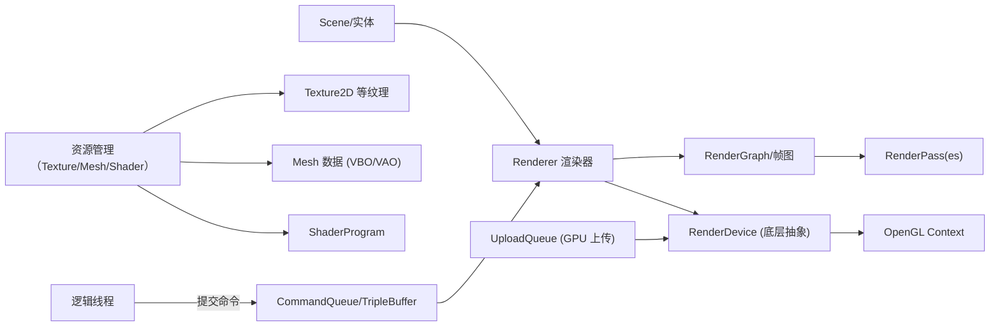

# 执行摘要

本报告提出了一个面向高性能渲染的 Java OpenGL 库重构方案。在功能上强调**低耦合、多线程、可扩展**：将渲染与逻辑分离，引入独立的渲染线程与命令队列（参考 BGFX 双缓冲设计），并设计**CommandBuffer/RenderDevice**等抽象层以隐藏底层 API，实现未来可替换渲染后端（仿照 Filament 的多后端设计）。在资源管理方面，引入**状态缓存**避免冗余 GL 调用（减少驱动开销）、**持久映射上传缓冲**与**环形实例缓冲**提高 CPU–GPU 同步效率。引入基于节点的**RenderGraph/RenderPass**框架（借鉴 Filament FrameGraph ）以管理渲染流程和资源依赖，支持 MSAA、FXAA、TAA 等抗锯齿管线，并对帧缓冲和纹理提供统一抽象并支持动态重建。其他关键设计包括通用**Material**系统（封装 Shader/纹理/状态），可重用的**MeshFormat**顶点布局，和通用的**TripleBuffer/GPU Fences**机制用于线程间数据交换。报告按模块和功能详细讨论了设计方案、API 示例和伪代码，并给出了分阶段迁移路线、性能验证计划、优先级清单及参考资料。

## 1. 关键设计目标与非功能需求

- **性能目标**：每帧预算约16ms，CPU 平均绘制调用 <2000/s，实例化对象数 ≈10000。通过**批处理与实例化**尽可能减小 CPU 调用压力，使用状态缓存和合并提交技术（如持久映射）减少驱动开销。  
- **延迟与吞吐**：追求低延迟渲染。渲染线程独立运行，逻辑线程与渲染线程异步并发，双缓冲/三缓冲流水线允许并行执行，避免 CPU 等待 GPU。异步的**上传队列**和持久映射缓冲可最大化带宽利用。  
- **线程模型**：采用**逻辑线程（主线程）**+**渲染线程**模式。逻辑线程构建渲染命令（CommandBuffer）并将数据写入三缓冲结构，渲染线程执行真实的 OpenGL 调用。所有 GL 操作限定在渲染线程进行（GLFW/LWJGL 要求单上下文绑定一个线程），通过线程安全队列或环形缓冲避免竞争。  
- **API 兼容性**：向下兼容 OpenGL 3.3+。设计中引入 RenderDevice/RenderAPI 抽象层，为将来支持 Vulkan/Metal 预留接口（类似 Filament 对多个后端的设计）。用户层接口依然易用：通过 `renderer.submit(mesh, material)` 等调用即可，无需直接操作 GL 状态。  
- **可扩展性与稳定性**：架构清晰分层，各模块低耦合，新增功能（如后处理、延迟渲染、GI 等）可在 RenderGraph 中插入新 Pass，而不重构核心。资源生命周期统一管理（RAII 风格），保障可靠关闭和复用。维护友好：避免使用裸整型 ID 代替资源句柄（推荐用类型安全的类封装 ID），并做好错误检测（GL Debug）和多线程安全保障。  

> *设计原则示例：Filament 将渲染流程拆分为多后端、多阶段的 FrameGraph（资源与 Pass 节点）；BGFX 则采用双缓冲命令流设计，多线程并行提交与渲染。我们的设计综合借鉴了这些实践，结合 Java 环境特点进行裁剪。*

## 2. 高层架构图与类/包建议

下面给出模块关系图（Mermaid 格式）和主要类职责表，展示重构后的分层结构：  



- **Scene/实体**：维护 MeshRenderer、Transform、Light、Camera 等对象。管理摄像机和物体变换，可做视锥体剔除或分层剔除。  
- **Renderer 渲染器**：执行渲染流程（如 Shadow Pass、Opaque Pass、Transparent Pass、后处理 Pass 等），使用 RenderGraph 填充多个 RenderPass，最终提交给 RenderDevice。  
- **RenderGraph（帧图）**：管理 Pass 和资源依赖关系，保证按拓扑顺序执行，实现自定义的渲染流程（支持导入上一帧纹理用于 TAA 等）。  
- **RenderPass**：定义渲染目标（颜色/深度纹理）、清除操作和具体绘制回调。  
- **Material 材质系统**：封装 ShaderProgram、纹理绑定、光栅状态（混合、剔除、深度测试等）和可控参数（Uniform）。支持 Material 定义和实例（同一 Shader 不同参数实例化）。  
- **RenderDevice**：渲染 API 入口，将 Draw/Bind 等高层命令映射到具体的 OpenGL/Vulkan 调用。内部维护**StateCache**，在重复绑定同一资源时跳过 GL 调用。实现多后端可替换（目前为 OpenGL）。  
- **CommandBuffer/CommandQueue**：命令缓冲区封装绘制命令序列，允许逻辑线程异步构建。CommandQueue（或三缓冲）负责在逻辑和渲染线程间交换数据。  
- **UploadQueue**：收集 CPU 到 GPU 的数据上传请求（顶点缓冲、纹理数据等），在渲染线程安全地执行，避免直接在逻辑线程阻塞。  
- **InstanceBufferRing**：专门用于实例化数据的动态环形缓冲，底层可用持久映射（GL_ARB_buffer_storage）实现，同时配合 GPU Fence 管理同步。  
- **TriangleBuffer/TripleBuffer**：通用的多缓冲数据交换容器，用于在逻辑线程和渲染线程之间传递数据（如变换矩阵列表、实例数据等），保证最少同步阻塞。  

下面表格总结了主要类/包、职责和关键线程归属：  

| 类/模块               | 职责                                         | 关键方法/属性                                | 运行线程    |
|---------------------|--------------------------------------------|-----------------------------------------|----------|
| **RenderDevice**    | 抽象渲染接口，封装底层 API（OpenGL/Vulkan）        | createBuffer(), createShader(), drawIndexed(), bindPipeline() | 渲染线程   |
| **StateCache**      | 缓存当前绑定状态，避免重复 gl 调用                  | bindProgram(id), bindVAO(id), bindTexture(id) | 渲染线程   |
| **CommandBuffer**   | 存储绘制与状态命令的序列，可异步构建与执行            | pushBindShader(...), pushDraw(...), reset()  | 逻辑/渲染 |
| **CommandQueue**    | 逻辑线程与渲染线程间命令缓冲区传递                  | submit(CommandBuffer), getNext(), notifyRender() | 逻辑/渲染 |
| **UploadQueue**     | 存储 CPU->GPU 的数据上传任务并在渲染线程执行           | submit(UploadReq), flush()               | 逻辑/渲染 |
| **Material**        | 封装 Shader、纹理、Uniform 和渲染状态                | setTexture(name, tex), setUniform(name, val), bind(cmd) | 逻辑（设置）/渲染（绑定） |
| **RenderPass**      | 定义帧缓冲目标和绘制逻辑（Clear + 渲染命令）          | addColorAttachment(name), setClearFlags(flags), execute(...) | 渲染线程   |
| **RenderGraph**     | 管理 RenderPass 节点和资源依赖，调度执行渲染流程         | addPass(name, setupLambda, execLambda), compile(), execute() | 渲染线程   |
| **Scene**           | 场景图管理：Entity 列表、光源、相机等               | addEntity(), removeEntity(), update()      | 逻辑线程   |
| **Renderer**        | 渲染入口：驱动各 RenderPass 对场景执行绘制，管理层次     | render(scene, camera)                   | 逻辑线程（触发） |
| **TripleBuffer<T>** | 多缓冲交换（比如实例矩阵列表），实现无阻塞生产者-消费者  | write(), read(), flip()                  | 逻辑/渲染 |

*图中各节点之间的数据流示例：逻辑线程通过 CommandQueue 向渲染线程提交绘制命令；Renderer 调用 RenderGraph 生成各 RenderPass，并通过 RenderDevice 在渲染线程执行。资源管理统一由 ResourceMgr 负责加载、缓存纹理和 Mesh 数据。*

## 3. 详细设计

### 3.1 CommandBuffer / RenderDevice / StateCache

- **CommandBuffer**：提供类似 Vulkan 的命令构建接口，逻辑线程调用的所有渲染操作（绑定状态、绘制调用等）不直接执行 GL 调用，而是记录到 CommandBuffer 对象中。示例伪代码：
  ```java
  CommandBuffer cmd = RenderDevice.createCommandBuffer();
  cmd.bindShader(myShader)
     .setUniform("uViewProj", camera.getViewProj())
     .bindVertexArray(myMesh.getVAO())
     .drawElements(GL_TRIANGLES, myMesh.getIndexCount());
  CommandQueue.submit(cmd);
  ```
  这样，`bindShader`、`drawElements` 等实际上只向内部列表添加命令，并未执行 OpenGL。一帧结束或在适当时间点，渲染线程从 CommandQueue 获取 CommandBuffer，并调用 `RenderDevice.execute(cmd)` 执行其中所有命令。  

- **RenderDevice**：渲染抽象层，将逻辑高层操作翻译为具体 GL 调用。内部维护一个**状态缓存**（StateCache），存储当前绑定的 Shader、VAO、纹理单元等。在执行命令时，如 `bindShader(id)` 会首先检查是否与当前状态相同，若相同则跳过 `glUseProgram` 调用；否则再绑定并更新缓存。这可避免冗余调用，降低 API 开销。示例 StateCache 模拟实现：
  ```java
  class StateCache {
      private int currentProgram = 0;
      void bindProgram(int id) {
          if (id != currentProgram) {
              glUseProgram(id);
              currentProgram = id;
          }
      }
      // 类似 bindVAO, bindTexture 等
  }
  ```
  RenderDevice 会用 StateCache 来优化所有绑定操作，从而实现“只在必要时才切换状态”。例如：
  ```java
  // CommandBuffer 中添加:
  cmd.append(c -> { stateCache.bindProgram(shader.id()); shader.applyUniforms(); });
  // RenderDevice 在执行时:
  for (Command c : cmd.getCommands()) {
      c.execute(stateCache);
  }
  ```
  **错误处理**：RenderDevice 和 CommandBuffer 的方法需要检查 GL 错误状态，可在调试模式下自动调用 `glGetError` 或借助 `GlDebug.checkError()`。资源类在 close() 时应保证幂等。

### 3.2 UploadQueue

- **用途**：专门处理 CPU 向 GPU 端传输大量数据（如顶点数据、纹理像素）而不阻塞渲染主循环。逻辑线程通过 `UploadQueue.submit(new UploadRequest(...))` 将上传任务（例如 `BufferUpload`、`TextureUpload`）推入队列。渲染线程在适当时机（如帧开始时）调用 `uploadQueue.flush()`，依次执行所有请求。这样可以将所有 `glBufferData/subData`、`glTexImage` 等操作集中在渲染线程，避免在逻辑线程与 GL 同步。  

- **API 示例**：
  ```java
  // 定义一个上传请求接口
  interface UploadRequest { void execute(RenderDevice dev); }

  // 上传顶点缓冲数据的例子
  class VertexBufferUpload implements UploadRequest {
      private int bufferId; FloatBuffer data;
      VertexBufferUpload(int id, FloatBuffer d) { bufferId=id; data=d; }
      public void execute(RenderDevice dev) {
          dev.bindBuffer(GL_ARRAY_BUFFER, bufferId);
          dev.bufferData(GL_ARRAY_BUFFER, data, GL_STATIC_DRAW);
      }
  }

  // 使用：
  FloatBuffer vertices = ...; // 拥有顶点数据
  int vboId = glGenBuffers();
  uploadQueue.submit(new VertexBufferUpload(vboId, vertices));
  // ...
  // 在渲染线程：
  uploadQueue.flush(renderDevice);
  ```

- **持久映射**：为了尽量减少 API 调用次数，可结合持久映射（ARB_buffer_storage + MAP_PERSISTENT_BIT）策略。创建时一次性调用 `glBufferStorage` 并映射缓冲区，之后无需再 unmap，每帧直接通过 `ByteBuffer` 指针对缓冲区内容写入，然后通过写入范围的 fence 实现同步（见下节实例化方案）。  

### 3.3 InstanceBufferRing（实例化缓冲）

- **设计目标**：高效管理每帧变化的实例数据（如物体变换矩阵或其它 per-instance 属性），最大程度避免 CPU/GPU 争用。借鉴 BGFX 对“Transient Buffers” 的使用。设计一个环形缓冲（帧环 Buffer），大小为最大实例数×实例属性大小×帧数（通常3倍）；使用持久映射方式映射到 CPU 可写内存。  

- **工作流程**：
  1. **映射与偏移**：创建时用 `glBufferStorage` 分配总大小缓冲并映射，保存起始指针。每帧选择一个段偏移 `offset = (frameIndex % 3) * frameSize`。
  2. **写入数据**：逻辑线程将模型矩阵或实例数据写入映射指针的对应偏移位置。例如：
     ```java
     // frameIndex 为当前帧计数
     int maxInstances = 1024;
     int mat4Size = 16 * Float.BYTES;
     int frameSize = maxInstances * mat4Size;
     int offset = (frameIndex % 3) * frameSize;
     FloatBuffer ptr = instBuffer.getMappedBuffer(offset, mat4Size * count);
     // 填充 count 个 Matrix4f 到 ptr 中
     ptr.put(...); // 举例填充变换矩阵数据
     ```
  3. **提交绘制**：设置顶点属性指针时，使用 `glVertexAttribPointer` 的偏移参数绑定到缓冲内的对应区域，并设置 `glVertexAttribDivisor` 为 1 以启用实例化渲染。  
  4. **同步（Fence）**：在缓冲写入后立即插入一个 GPU 栅栏 `glFenceSync(GL_SYNC_GPU_COMMANDS_COMPLETE,0)`。下一次写入该缓冲区前，检查前一帧相同段的 fence 已经完成，必要时使用 `glClientWaitSync` 等待。如需更少阻塞，可采用三缓冲策略（frameIndex % 3），确保 CPU/GPU 很少在同一片段争用。  

- **示例伪代码**（简化，省略错误检查）：
  ```java
  // 假设 instBuffer 已用 glBufferStorage 持久映射
  int blockSize = maxInstances * 16 * Float.BYTES;
  int index = frame % 3;
  int offset = index * blockSize;
  FloatBuffer mapped = instBuffer.mapRange(offset, blockSize);
  // 写入 N 个实例矩阵
  for (Matrix4f m : matrices) {
      m.get(mapped); // 假设矩阵按列主序
  }
  // 提交实例绘制
  renderDevice.setVertexAttribFormat( ... , offset);
  renderDevice.drawElementsInstanced(mesh, matrices.size());
  // 同步栅栏，标记GPU将要使用此数据
  long sync = glFenceSync(GL_SYNC_GPU_COMMANDS_COMPLETE, 0);
  // 下帧前可选择等待(sync)或直接覆盖下一个分段
  ```

- **最小拷贝路径**：由于使用持久映射，数据写入仅是一次内存拷贝，无需多次调用 GL API（参考持久映射概述）。整个流程只在每帧做一次 memcpy，避免了 glBufferSubData 多次开销。环形布局保证 GPU/GPUdriver/CPU 三方几乎无需互相等待。

### 3.4 Material 材质系统

- **目的**：将 Shader 程序、纹理资源、Uniform 值和渲染状态（混合、剔除、深度测试等）打包为统一实体，简化用户调用。灵感来源于 Filament 材质概念：“材质定义了表面的外观，包括着色模型、可调参数、光栅状态、顶点/片段着色器等”。  

- **设计**：
  - `Material` 类持有一个或多个 `ShaderProgram`（例如一个材质可能包含多种 Pass 的 shader），以及对应的资源和参数字典。  
  - **参数设置**：提供链式接口或 Builder 模式设置纹理和参数，如：
    ```java
    Material mat = Material.builder()
        .shader(shaderProgram)
        .texture("uAlbedo", wallTexture)
        .setFloat("uMetallic", 0.5f)
        .blendMode(BlendMode.ALPHA)
        .build();
    ```
    用户可以创建 `MaterialInstance`（如果需要多个对象使用同一 Shader 但不同 Uniform 值），或直接使用 Material。在渲染时，Renderer 会调用 material.bind(cmdBuffer) 将所有资源绑定到管线：绑定 ShaderProgram，设置所有 Uniform，激活纹理单元，应用混合等状态。  

- **Uniform 缓冲**：对于全局或多实例共享的数据，可考虑使用统一的 UBO (Uniform Buffer Object)，提高批量更新效率；Material 可自动管理其 UBO，并通过 `setUniform` 更新值后在渲染阶段统一上传。  

- **示例使用**：
  ```java
  // 创建材质
  Material material = Material.builder()
      .shader(myShader)
      .texture("uDiffuse", brickTexture)
      .setVec3("uTint", new Vector3f(1.0f, 1.0f, 1.0f))
      .blendMode(BlendMode.OPAQUE)
      .build();
  // 提交绘制
  renderer.submit(mesh, material, transformMatrix);
  ```
  Renderer 在内部将 mesh, material, transform 打包成命令，通过 RenderPass 调用 Material 进行绑定和 Mesh.draw()。  

### 3.5 RenderPass / RenderGraph （渲染管线）

- **RenderPass**：表示渲染流水线中的一个阶段，包括输入输出资源（颜色/深度纹理）、清除操作，以及实际绘制逻辑（通常是一个回调）。可使用建造者模式定义 Pass。例如：
  ```java
  // 添加一个几何 Pass
  renderGraph.addPass("GeometryPass",
      builder -> {
          builder.createTexture("gbuffer0", W, H, Format.RGBA8);
          builder.createTexture("depth", W, H, Format.DEPTH24);
          builder.declareRenderTarget(
              new RenderTargetDesc("GeometryTarget")
                  .setColor("gbuffer0").setDepth("depth")
          );
          builder.clearColor(0.1f, 0.1f, 0.1f, 1.0f);
      },
      (resources, cmd) -> {
          // 在这个 Pass 内实际绘制场景几何体
          Material shader = resources.getMaterial("geometry");
          shader.bind(cmd);
          shader.setUniform("uProjView", camera.getProjView());
          scene.drawOpaque(cmd, shader);
      }
  );
  // 添加一个后期 FXAA Pass
  renderGraph.addPass("FXAAPass",
      builder -> {
          builder.readTexture("gbuffer0");
          builder.createTexture("fxaaOut", W, H, Format.RGBA8);
          builder.declareRenderTarget(
              new RenderTargetDesc("FXAATarget").setColor("fxaaOut")
          );
          builder.clearColor(0, 0, 0, 1);
      },
      (resources, cmd) -> {
          Material fxaa = resources.getMaterial("fxaa");
          fxaa.bind(cmd);
          fxaa.setTexture("uSceneTex", resources.getTexture("gbuffer0"), 0);
          ScreenQuad.draw(cmd); // 绘制全屏四边形
      }
  );
  ```

- **RenderGraph（帧图）**：集中管理所有 Pass。用户通过 `addPass` 注册各 Pass 的资源需求和绘制回调。内部将这些 Pass 节点拓扑排序，计算资源生存期与依赖关系。例如，如果 TAA 需要上一帧的输出，则可以“导入”上一帧纹理作为外部资源。  
  执行时，RenderGraph 依次迭代排序后的 Pass，绑定相应帧缓冲并调用回调中的绘制命令。它还负责资源的自动创建与销毁：例如纹理附件在不再使用后会释放。  

- **抗锯齿集成**：在 RenderGraph 中插入抗锯齿 Pass 比如 MSAA、FXAA、TAA 等：  
  - **MSAA**：几何 Pass 可启用多重采样 FBO。图形完成后，通过 blit 或额外 Pass 将 MSAA 缓冲解析到单采样纹理。  
  - **FXAA/TAA**：作为后处理 Pass 加入管线。FXAA 直接对当前颜色纹理做全屏滤波。TAA 则需要双缓冲（上一帧与当前帧），故需要在帧图外部保留上一帧渲染结果，并在新增 TAA Pass 中作为输入。  
  - **帧缓冲抽象与重建**：所有 RenderPass 中使用的纹理附件均应为抽象对象（如 `RenderTarget` 或 `Texture`），而非裸 int 句柄。这样在窗口大小变化时，可通过 RenderGraph 或 RenderTarget 机制自动重建具有新尺寸的纹理。每个 Pass 的构建 lambda 可以根据全局 `width`/`height` 动态分配，使 resize 时重新执行管线设置。

### 3.6 Scene 与 Renderer

- **Scene (场景)**：管理实体（Entity）和组件（组件可包括 MeshRenderer、Light、Camera 等）。典型实现可参考 ECS 结构：实体 ID + 变换 + 渲染组件。场景负责收集所有可见对象并进行剔除（简单的视锥体剔除或分块剔除可选）。  

- **Renderer (渲染器)**：负责调用 RenderGraph 来执行整个场景的渲染。示例流程：  
  1. **剔除/排序**：根据当前 Camera 视椎剔除不可见实体；对于不透明对象，可按 Shader/材质分组减少状态切换；对于半透明对象可按深度排序。  
  2. **提交绘制**：将剩余对象提交给相应 RenderPass（例如 GeometryPass）。实际提交可调用 CommandBuffer。例如：
     ```java
     for (Renderable obj : scene.getOpaqueRenderables()) {
         Material mat = obj.getMaterial();
         cmd.bindShader(mat.getShader());
         mat.applyUniforms(cmd);
         cmd.bindVertexArray(obj.getMesh().getVAO());
         cmd.drawElements(GL_TRIANGLES, obj.getMesh().getIndexCount());
     }
     ```
  3. **后处理**：在透明物体渲染后，可执行天空盒、UI、后处理 Pass（如 Bloom、Tonemapping）。  
  4. **展示**：最后将最终纹理输出到屏幕（glBlit 或在 Swapchain 目标上绘制）。  

  `renderer.render(scene, camera)` 这一调用将封装上诉流程。用户只需维护好 Scene 数据结构和 Camera，对象变换变化后调用 update 即可。  

### 3.7 TripleBuffer 交换与线程交互

- **TripleBuffer<T> 用法**：逻辑线程通过 `tripleBuffer.write()` 获得当前可写缓冲区（类型 T，一般为 List、Array 等），填充数据后调用 `tripleBuffer.flip()` 将写入区提交。渲染线程随后调用 `tripleBuffer.read()` 读取最新数据，例如实例变换矩阵列表。设计上确保三帧轮转，避免生产者和消费者同时操作同一区域。示例：
  ```java
  TripleBuffer<List<Matrix4f>> transformBuffers = new TripleBuffer<>(ArrayList::new);
  // 逻辑线程：写入
  List<Matrix4f> writeList = transformBuffers.write();
  writeList.clear();
  populateTransforms(writeList, frameIndex);
  transformBuffers.flip();
  // 渲染线程：读取
  List<Matrix4f> drawList = transformBuffers.read();
  for (Matrix4f model : drawList) {
      cmd.setUniform("uModel", model);
      cmd.drawElements(...);
  }
  ```

- **线程交互**：逻辑线程负责生成数据和命令，不做任何 GL 调用；渲染线程则从队列中取出命令和数据并调用 GL。典型同步策略：  
  - **命令队列**：使用无锁队列或 RingBuffer 保存 CommandBuffer，逻辑线程结束后 push 到队列，渲染线程从队列 pop。可用信号量或锁在需要时同步。
  - **阻塞最小化**：逻辑线程不主动等待渲染，渲染线程也仅在没有可用命令时阻塞。采用三缓冲机制避免逻辑线程被卡住。  
  - **内存屏障与 GC 缓解**：避免在每帧创建大量短命对象（如 ArrayList、命令对象等），可重用容器并 `clear()`。对于 GPU 数据（顶点/实例数据），推荐使用直接缓冲区（DirectByteBuffer）或持久映射内存，减少 GC 压力。尽量在初始化时分配好所有 Buffer 并反复写入而非重新分配。  

> *注：OpenGL 上下文必须绑定在同一线程，故**逻辑线程**只能构建命令和数据，实际 GL 调用只在**渲染线程**发生。该模式参照 BGFX 多线程渲染设计。*

## 4. VAO/VertexLayout 改进

- **MeshFormat 可复用布局**：引入 `MeshFormat` 或 `VertexLayout` 类来描述顶点格式，将格式与数据分离。用户可先定义布局，如：
  ```java
  VertexLayout posColorLayout = VertexLayout.builder()
      .addAttribute(0, 3, GL_FLOAT, false, 0)           // 位置 (vec3)
      .addAttribute(1, 3, GL_FLOAT, false, 3*4)         // 颜色 (vec3)
      .setStride(6*4).build();
  ```
  然后创建 Mesh 时使用此布局：
  ```java
  Mesh mesh = new Mesh(posColorLayout, vertices, indices);
  ```
  这样若有多个 Mesh 使用相同布局，只需复用 `posColorLayout`，避免重复配置。  

- **非交错/交错支持**：`VertexLayout` 支持两种模式：  
  - **交错 (Interleaved)**：一个 VBO 存放所有属性（ stride = sum(attrSize) ），如上例。  
  - **非交错 (Separate VBOs)**：允许每个属性单独一个 VBO。比如位置和纹理坐标分别上传到不同的缓冲区，再分别绑定到 VAO 的不同属性上。新的 API 支持：
    ```java
    mesh.setVertexBuffer(0, positionBuffer);
    mesh.setVertexBuffer(1, texCoordBuffer);
    ```
    这对需要频繁只更新部分属性（如只更新位置）或共享顶点缓冲的场合有用。  

- **顶点压缩 (Packing)**：对某些属性应用压缩存储以节省内存。例如法线可用八叉面编码（Octahedral Normal）：3D法线向量 `(nx,ny,nz)` 编码成 32 位整数；或者使用 `GL_UNSIGNED_SHORT` / `GL_UNSIGNED_INT_10_10_10_2` 格式存储顶点颜色、法线等。以下为法线八叉面编码示例（伪码）：
  ```java
  // Octahedral encoding of normalized vector (x,y,z) to 2×16bit
  int packed = VertexPacking.packOctNormal(nx, ny, nz);
  float[] unpacked = VertexPacking.unpackOctNormal(packed);
  ```
  应用到顶点布局时，可将法线作为单一整数属性上传，Shader 端再解码使用。  

- **批量压缩上传**：当存在大量小 Mesh 时，可将它们合并到一个大顶点缓冲，再一次调用 `glBufferData`。示例伪代码：
  ```java
  // 合并多个 Mesh 的顶点数据到一个大缓冲
  int totalVerts = meshA.count + meshB.count;
  FloatBuffer combined = MemoryUtil.memAllocFloat(totalVerts * vertexSize);
  combined.put(meshA.vertices).put(meshB.vertices).flip();
  glBindBuffer(GL_ARRAY_BUFFER, bigVBO);
  glBufferData(GL_ARRAY_BUFFER, combined, GL_STATIC_DRAW);
  MemoryUtil.memFree(combined);
  // 再次绘制时通过偏移绘制不同子网格：
  glDrawArrays(GL_TRIANGLES, 0, meshA.count);
  glDrawArrays(GL_TRIANGLES, meshA.count, meshB.count);
  ```
  这种“批量上传”避免多次调用 `glBufferData`，在适合场景下可显著提升效率。  

## 5. 实例化与批处理方案

- **InstancedMeshBatch 改进**：现有 `InstancedMeshBatch` 将 Mesh 与实例绑定，可考虑扩展为更通用的批处理类。建议接受一个通用的网格格式和动态实例数据源，而非在构造时固定网格。比如：
  ```java
  InstancedMeshBatch batch = new InstancedMeshBatch(coloredQuadLayout);
  batch.addInstances(coloredQuadMesh, transformList);
  ```
  底层为每种网格类型维护动态实例缓冲（环形、持久映射），并在 `flush()` 时统一绘制。  

- **持久映射与环形设计**：使用持久映射缓冲来存储实例变换矩阵，结合帧环实现三倍缓冲。每帧只映射一次，通过在缓冲中以 `frameIndex % 3` 计算块偏移，避免 CPU/GPU 冲突。使用 `glBindBufferRange` 绑定不同偏移作为实例属性源，从而仅更新新增实例数据。示例：
  ```java
  // 在 InstancedMeshBatch.flush() 中：
  int offset = (frameIndex % 3) * maxInstances * mat4Size;
  FloatBuffer mapped = instBuffer.mapRange(offset, instanceCount * mat4Size);
  for (Matrix4f m : transforms) { m.get(mapped); }
  stateCache.bindBufferBase(GL_UNIFORM_BUFFER, instUBO, offset / mat4Size);
  // 绘制
  glVertexAttribDivisor(0, 1);
  mesh.drawInstanced(instanceCount);
  // 插入栅栏
  glFenceSync(GL_SYNC_GPU_COMMANDS_COMPLETE, 0);
  ```
  这样在多实例绘制中，实现了最小的数据拷贝路径和自动同步。  

- **内存对齐**：确保每个实例元素按照 GPU 要求对齐（一般至少 16 字节对齐）。为保证对齐，可在环形缓冲中根据 std140/std430 规则安排数据布局。

## 6. 抗锯齿管线集成

- **MSAA**：在需要时创建多重采样帧缓冲 (e.g. `RenderTarget.createMultiSampled(width, height, samples)`)。几何 Pass 输出到 MSAA FBO，然后使用 `glBlitFramebuffer` 或额外 Resolve Pass 将其解析到单样本纹理。RenderGraph 可将两者作为连续 Pass 实现。  

- **FXAA/后处理**：FXAA 等屏幕空间抗锯齿作为后处理 Pass 加入 FrameGraph。如上例所示，将场景颜色纹理作为输入，在新的 Pass 中绑定目标纹理并执行 FXAA 着色器。  

- **TAA/Temporal AA**：需要跨帧融合。设计时需允许将上一帧输出作为当前 Pass 的输入资源（Filament 提到要“导入上一帧输出”）。可在 RenderGraph 外管理一个纹理池：每帧在图结束后将最终纹理缓存起来，下一帧在 TAA Pass 时重新绑定为输入。FrameGraph 机制应支持“外部资源导入”，并在构建时标记为非销毁资源。  

- **纹理抽象与重建**：统一使用 `Texture` 或 `RenderTarget` 对象封装 FBO 附件，消除原生 ID 泄漏。每当窗口尺寸变化时，对应的 RenderTarget 应触发重建：例如 Renderer 在 GLFW 回调中设置 newWidth/newHeight，并让 RenderGraph 重新运行各 Pass 的 setup 部分以分配新的纹理。  

## 7. 渲染线程与逻辑线程交互

- **命令序列化**：逻辑线程通过 CommandBuffer/TripleBuffer 提交所有渲染操作，保证渲染线程独占 GL 调用。可使用线程安全队列或锁-free 环形缓冲在两者之间交换 CommandBuffer 对象。两线程间尽量减少锁争用，渲染线程以生产者-消费者模式获取已提交的命令列表。  

- **最小阻塞设计**：采用三缓冲或双缓冲避免生产者-消费者互相等待。逻辑线程永远写入“空闲”缓冲，渲染线程始终使用另一个缓冲。若渲染线程过慢，可考虑丢弃旧帧或暂时同步（如加速 `glClientWaitSync`）。逻辑线程在填写数据时不做阻塞等待，最多在背面板同步处（如调用 `glFenceSync`）使用小额超时等待，避免死锁。  

- **内存屏障**：OpenGL 中大部分调用隐式产生同步（如 `glFenceSync` 插入 GPU 栅栏）。在持久映射方案中使用 `GL_MAP_COHERENT_BIT` 可使写入自动对 GPU 可见，否则需在写入后调用 `glMemoryBarrier`。总的策略是：逻辑线程写入时无需立即等待；渲染线程在读取之前，通过 `glClientWaitSync` 等待写入段的 fence 。

- **GC 影响缓解**：尽量避免在渲染循环中分配大量临时 Java 对象。使用对象池或静态容器重用（例如 `ArrayList.clear()` 而非新建）来存放命令或数据。对于大量数据传输，优先使用 `ByteBuffer.allocateDirect()` 或 LWJGL 的 MemoryUtil 分配缓冲区，并复用这些缓冲。必要时可手动触发 System.gc 或内存整理，但应预先分配足够空间防止频繁 GC。  

## 8. 性能验证计划

- **基准场景**：设计多种测试场景：包括大量静态三角形、复杂材质渲染、实例化渲染（数千实例）、2D/3D 混合场景等。同时包括 UI 或后期效果场景。  
- **测量指标**：每帧 CPU 绘制调用率（draw calls/s）、顶点/三角形吞吐量、GPU 上传带宽使用率（顶点/纹理数据）、平均和最差帧时延 (ms)、内存使用（GPU/CPU）。使用内置 `RenderStatistics` 或外部工具（RenderDoc、NVIDIA NSight、GLTimerQuery）记录详细数据。  
- **对比基线**：首先记录现有实现的性能数据作为基线。迁移各阶段后，对比相同场景下的新实现数据：期望看到 CPU 侧绘制调用减少（通过实例化、合并），GL 调用更高效（状态缓存消除冗余）、上传带宽提升（持久映射三缓冲）。  
- **目标阈值**：例如目标每帧 CPU 绘制调用 <2000，大部分场景平均帧时 <16ms。实例化场景下 GPU 也能持续输出 >60FPS。多线程重构后，逻辑和渲染线程应并行利用多核资源。  
- **验证工具**：使用内置统计（帧时测量、平均/抖动 FPS）、外部分析（VisualVM 查看 GC、分析 CPU 瓶颈）。抗锯齿效果需对比视觉质量，保证新管线正确性。  

## 9. 迁移路线图

**阶段 1：CommandBuffer 与多线程架构** （约10人日）  
- 实现 `CommandBuffer`、`RenderDevice` 和 `StateCache`，替换 Demo 中的直接 GL 调用。  
- 引入渲染线程（`GlRenderThread`），并建立线程安全命令队列。初步验证：使用 CommandBuffer 重写 demo，确保输出一致。  
- 验收：Demo 场景渲染正确；逻辑/渲染线程并行运行；使用 StateCache 后 `glUseProgram` 调用次数明显减少。  

**阶段 2：Material 与 Mesh 抽象** （约8人日）  
- 引入 `Material` 和 `MaterialInstance`，重构现有 ShaderProgram/纹理使用。实现统一的 Uniform 绑定接口。  
- 改进 `Mesh` 构造：支持可复用 `MeshFormat`（布局）和非交错数据。  
- 验收：使用 `Material` 重新编写 Demo，功能等同；顶点布局可复用，不影响渲染；状态缓存兼容变化材质情况。  

**阶段 3：RenderPass/RenderGraph** （约7人日）  
- 实现 FrameGraph 构建与执行逻辑，重写 demo 渲染流程。所有渲染操作移入 Pass。  
- 增加基本管线：Geometry Pass、Bloom/FXAA Pass 等，验证 FrameGraph 拓扑排序与资源管理功能。  
- 验收：可通过 RenderGraph 动态增减 Pass，不需要修改核心渲染代码；增加多通道渲染时无错误；TAA 测试可正确使用上一帧数据。  

**阶段 4：持久映射与实例化优化** （约7人日）  
- 实现 UploadQueue 和持久映射缓冲策略；改造 InstancedMeshBatch 使用 Persistent Mapped Buffer + 环形策略。  
- 验收：静态网格上传延迟降低，实例化渲染场景 CPU 开销明显下降；无显著同步 stall（参考）。  

**阶段 5：抗锯齿管线与完整性测试** （约5人日）  
- 集成 MSAA（可在设置中切换），实现 FXAA/TAA Pass。完善 RenderTarget 重建逻辑（窗口 resize）。  
- 验收：不同抗锯齿模式下渲染效果正确切换；窗口缩放后管线重建正常；性能指标符合预期。  

每阶段后通过自动化测试和性能基准验收**结果**。**风险**：多线程引入死锁或竞态（回退至单线程模型保证正确）；RenderGraph 实现难度大（可先用简单线性流程过渡）；持久映射在部分平台不支持（检测扩展后再行启用）。总体预计开发约 30–40 人日。

## 10. 代码示例

- **CommandBuffer 构造/提交**：
  ```java
  CommandBuffer cmd = renderDevice.createCommandBuffer();
  cmd.bindShader(shaderProgram)
     .setMat4("uProj", projMatrix)
     .setMat4("uView", viewMatrix)
     .bindVertexArray(mesh.getVAO())
     .drawElements(GL_TRIANGLES, mesh.getIndexCount());
  CommandQueue.submit(cmd);
  ```

- **UploadRequest 示例**：
  ```java
  // 上传纹理数据
  class TextureUpload implements UploadRequest {
      private int texId; ByteBuffer pixels;
      public void execute(RenderDevice dev) {
          dev.bindTexture(GL_TEXTURE_2D, texId);
          dev.texImage2D(GL_TEXTURE_2D, 0, GL_RGBA8, width, height, 0, GL_RGBA, GL_UNSIGNED_BYTE, pixels);
          dev.generateMipmap(GL_TEXTURE_2D);
      }
  }
  uploadQueue.submit(new TextureUpload(texture.getId(), imageBuffer));
  ```

- **Material 定义**：
  ```java
  Material brick = Material.builder()
      .shader(ShaderProgram.fromResources("pbr.vert", "pbr.frag"))
      .texture("uAlbedo", brickTexture)
      .texture("uNormalMap", brickNormal)
      .setFloat("uRoughness", 0.6f)
      .build();
  ```

- **RenderPass 注册/执行**：
  ```java
  frameGraph.addPass("MainPass",
      builder -> {
          builder.createTexture("colorTex", fbWidth, fbHeight, Format.RGBA8);
          builder.declareRenderTarget(new RenderTargetDesc().setColor("colorTex"));
          builder.clearColor(0, 0, 0, 1);
      },
      (resources, cmd) -> {
          Material mat = resources.getMaterial("basic");
          mat.bind(cmd);
          mesh.draw(cmd);
      }
  );
  frameGraph.execute();
  ```

- **StateCache 用法**：
  ```java
  // 渲染循环中，重复绑定相同 shader 时会被跳过
  stateCache.bindProgram(shader1.getId()); // 真正 glUseProgram 调用
  // ... 绘制几何体 ...
  stateCache.bindProgram(shader1.getId()); // 缓存命中，不再调用 glUseProgram
  ```

- **实例化上传示例**：
  ```java
  // 假设 instUBO 已持久映射
  int offset = (frameIndex % 3) * maxInstances * mat4Size;
  FloatBuffer instMapped = instBuffer.mapRange(offset, count * mat4Size);
  for (Matrix4f m : instances) { m.get(instMapped); }
  renderDevice.bindBufferRange(GL_UNIFORM_BUFFER, instUBO, offset, count * mat4Size);
  // 使用 glDrawElementsInstanced 进行绘制...
  long fence = GL32.glFenceSync(GL32.GL_SYNC_GPU_COMMANDS_COMPLETE, 0);
  ```

## 11. 现有文件与新模块映射

| 旧文件（类名）              | 新模块/类                  | 说明（保留/重命名/拆分）                 |
|-------------------------|------------------------|-----------------------------|
| AntiAliasingMode.java   | util/AntiAliasingMode  | 保留（枚举，定义 AA 模式）               |
| AntiAliasPipeline.java  | renderer/AntiAliasPipeline | 保留（重命名或划归后处理管线模块）          |
| BatchedRenderQueue.java | batch/BatchedRenderQueue | 保留（稍作修改，作为 CPU 单线程命令排序）       |
| Camera.java             | scene/Camera           | 保留（Camera 对象）                    |
| DrawSortKey.java        | batch/DrawSortKey      | 重命名（如果不再使用命令排序则可删除）    |
| Framebuffer.java        | framebuffer/RenderTarget | 重命名、修改（改为 RenderTarget，抽象 Texture） |
| FxaaPostProcessor.java  | renderer/FXAAPass      | 拆分（合并到 RenderPass 中，不单独文件）     |
| GlBuffer.java           | gl/Buffer (or buffer/Buffer) | 拆分/重命名（不同缓冲类型分包：VertexBuffer, IndexBuffer, UniformBuffer） |
| GlDebug.java            | util/GLDebug           | 保留（GL 错误检查工具）               |
| GlException.java        | util/GLException       | 保留（自定义异常）                   |
| GlResource.java         | gl/GLResource         | 重命名（基础资源接口）                |
| GlRenderThread.java     | gl/RenderThread       | 新增（负责渲染线程与命令调度）          |
| GpuFence.java           | gl/GpuFence           | 保留（GPU 同步对象）                 |
| InstanceBufferRing.java | buffer/InstanceBufferRing | 保留（改进实例缓冲类）                |
| InstancedMeshBatch.java | batch/InstancedMeshBatch | 保留（优化实例批处理类）              |
| Mesh.java               | vertex/Mesh           | 重命名/拆分（将顶点属性、VAO、VBO 分离到独立类） |
| RenderCommand.java      | command/RenderCommand | 保留（或重命名为 GPUCommand）        |
| RenderCommandQueue.java | command/CommandQueue  | 重命名（作为命令缓冲队列）            |
| RenderLoop.java         | renderer/RenderLoop   | 保留（主循环入口，或集成到 Renderer）    |
| RenderSettings.java     | renderer/RenderSettings | 保留（渲染配置）                 |
| RenderStatistics.java   | util/RenderStatistics | 保留（统计工具）                   |
| ScreenQuad.java         | util/ScreenQuad       | 保留（绘制全屏四边形工具）            |
| ShaderProgram.java      | shader/ShaderProgram  | 保留（或者与 Material 整合）          |
| TemporalAccumulationPass.java | renderer/TemporalAAPass | 拆分（作为 RenderPass 实现，不单文件） |
| Texture2D.java          | texture/Texture2D     | 保留（或根据通用 Texture 拆分）         |
| TripleBuffer.java       | util/TripleBuffer     | 保留（多线程数据交换）               |
| VertexArray.java        | vertex/VertexArray    | 保留（管理 VAO）                  |
| VertexAttribute.java    | vertex/VertexAttribute | 保留（属性描述）                  |
| VertexLayout.java       | vertex/VertexLayout   | 保留（布局定义）                  |
| VertexPacking.java      | util/VertexPacking    | 保留（顶点数据压缩工具）             |

## 12. 优先级清单

**必须优先完成的 5 项**：  
1. **CommandBuffer/RenderDevice 架构**：实现命令缓冲和渲染抽象，确保现有功能无回归。  
2. **多线程分离**：引入独立渲染线程和命令队列，使用 TripleBuffer 同步，解除 GL 调用阻塞。  
3. **Material 系统**：实现统一的材质和 Uniform 接口，清理 Shader 资源绑定逻辑。  
4. **RenderPass/RenderGraph**：搭建可扩展的渲染框架，支持多 Pass 扩充，重构渲染流程。  
5. **持久映射上传**：优化大体量顶点/纹理上传，完成环形实例缓冲，提升 CPU–GPU 协同。  

**次要改进（10 项）**：  
6. MeshFormat 和 VAO 改进：可复用布局、支持分离 VBO。  
7. StateCache 实现：缓存 GL 状态、避免冗余绑定。  
8. 资源 ID 类型封装：使用强类型类替代裸 int（提升安全性）。  
9. Scene Graph / Culling：实现层次场景组织和基本剔除优化。  
10. 高级抽象：加入 RenderPass 辅助类如 RenderTargetDescriptor 等。  
11. GUI/ImGui 集成：可选 ImGui 支持，用于调试或工具。  
12. 日志/调试：完善渲染状态可视化、Profiler（CPU/GPU时间统计）。  
13. 平台扩展：考虑 Vulkan/Metal 后端兼容性代码结构。  
14. 文档与示例：更新用户文档，提供新的使用示例。  
15. 材质编辑工具：可选地支持材质编辑、热加载。

## 13. 参考资料

- Google Filament 官方文档，如 **FrameGraph** 设计说明、**材质系统**；Filament 源码仓库 README（多后端支持，轻量高效设计）。  
- BGFX 项目文档，提供了“双缓冲帧管道”和“资源延迟执行”的设计参考。  
- “Persistent Mapped Buffers” 博客（作者 Drobot）阐述了 GL 持久映射、双三缓冲技术和同步策略，为上传队列与环形缓冲方案提供了理论基础。  
- Khronos OpenGL 论坛与 LWJGL 社区讨论（线程模型、性能优化实践）。  
- The Forge 渲染框架文档（了解现代多线程渲染API设计理念）。  
- 《OpenGL 官方规范》以及 LWJGL 文档（用于具体 GL 函数使用和同步细节）。

以上资料中的概念和设计思想为本方案提供了参考依据，结合实际需求进行了适当调整。各小节引用了相关文献和实践案例，以确保设计的合理性和先进性。